# How to Build Spiral Stairs
Co-authored by Andrew Peters

Last Updated: January 5, 2025

Spiral staircases are eye-catching, aesthetic features fit for any gorgeous home. And if you're looking to build one in your space, you've come to the right place! We'll teach. you how to plan the layout, install the column, and build the stairs around it. Read on for a complete guide.

## Part 1 Planning the Layout of Your Staircase

1 Designate an unused corner or open, central area for your staircase. Pick out a spot between two floors of your home or building that you think would make a good location for a spiral staircase. Spiral staircases tend to work best in tight spaces and parts of the room that don’t receive heavy foot traffic, such as corners. Beyond that, where you put your staircase is entirely up to you.[1]

You might situate your spiral staircase in your home's foyer, or in a downstairs living room, open hallway, multi-level garage, or another suitable area.

Before you get started on your project, consult your local building codes and see what criteria they contain about spiral staircases. In some cases, building codes might dictate that staircases satisfy specific spatial dimensions, including width.[2]

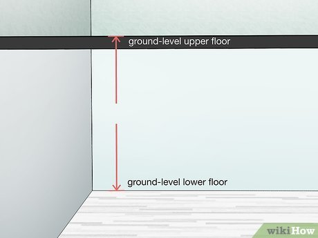

2 Measure from floor to floor to find the height of your staircase. Extend a measuring tape from ground-level on the lower floor to ground-level on the upper floor (or vice-versa). Write down the measurement you get to the nearest 1/8 in (0.32 cm). This number will tell you exactly how high your staircase needs to be.[3]

If one or both floors are carpeted, be sure to start your measurement from the underlying solid flooring rather than the top of the carpet, as this is the surface you’ll be building on.[4]

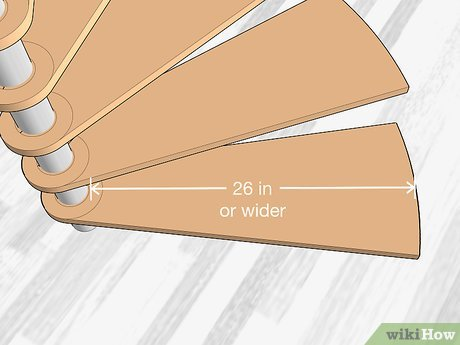

3 Give your staircase a minimum diameter of 26 inches (66 cm). Generally speaking, the wider your staircase is, the better it will look and the safer it will be. The total diameter of your spiral staircase, however, may be limited by the amount of space you have available. Ideally, you want your treads, or steps, to be at least 26 inches (66 cm) across in order to provide as much security and ease of navigation as possible.

Plan on adding at least 2 inches (5.1 cm) to the chosen diameter of your staircase to ensure adequate finger clearance along the outer handrail.[5]

Your spiral staircase may need to be a certain minimum width if it’s to serve as the main stairway for your home. For more information on stairway diameters or other safety considerations, consult your local building inspector or talk to a qualified contractor.[6]

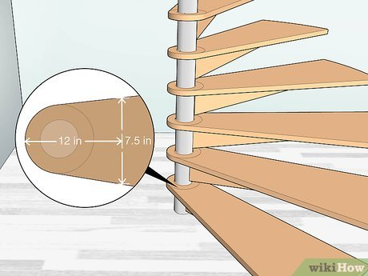

4 Make sure your treads are at least 7.5 inches (19 cm) deep on center. According to national building codes in the U.S., the minimum tread depth for a spiral staircase is 7.5 inches (19 cm) at a point 12 inches (30 cm) from each tread’s narrow end. This means that if you want your treads to be 36 inches (91 cm) wide, they’ll need to be at least 7.5 inches (19 cm) deep at the inside of the middle section. Make a note of this as you’re outlining your staircase’s individual dimensions.[7]

Remember that building codes (and therefore minimum required tread depths) may differ from place to place. To avoid costly errors, it’s always a good idea to check before you build.

Unlike ordinary stair treads, the treads on a spiral staircase taper on the interior edge where they attach to the central support column.

5 Calculate the exact number and spacing of your steps. Divide the height of your staircase (in inches) by 7, which is the ideal rise, or amount of vertical distance between each step, for most staircases. Round that number to the nearest whole step, then divide the height once again by your total number of steps to figure out how much distance you’ll need to leave between each step.[8]

For a planned staircase that’s going to be 96 inches (240 cm) high, you would divide 96 by 7 to get 13.71, or 14 steps. You would then divide 96 by 14 to conclude that each step should be placed 6.85 inches (17.4 cm) apart.

Each step of your staircase also needs to offer a minimum of 6 ft (1.8 m), 6 in (15 cm) of headroom in order to meet national building codes.

> Tip: You may need to add or subtract a step from your plans if your local building codes prescribe a certain minimum or maximum step height.

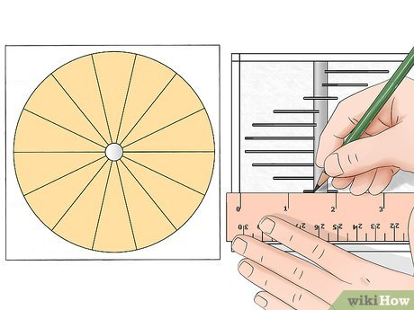

6 Draft a detailed building plan for your spiral staircase. Now that you’ve worked out the necessary dimensions for your staircase, sketch them out on a piece of paper. This will give you a handy visual aid that you can refer back to during the construction process. Be sure to label your plans with all of the important measurements, including the height and diameter of the staircase, the exact number of steps, and the optimal depth and spacing of each tread.[9]

Double-check your plans to confirm that they’re as complete and precise as possible. Making a mistake in the planning phase could end up costing you time and money once you actually begin building.

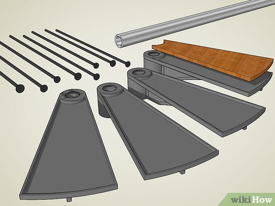

7 Consider purchasing a modular spiral stairway kit for ease of assembly. Most spiral staircases aren’t built from the ground up. Instead, they’re assembled from modular kits, which come in a variety of dimensions, materials, and styles. If you just want to add an attractive spiral staircase to your living space without the painstaking work of measuring, cutting, and configuring each component yourself, a modular kit is the way to go.[10]

Modular kits come complete with everything that you need to put your staircase together, along with full, detailed instructions to guide you through the assembly process from beginning to end.

Modular spiral staircase kits can range in price from as low as \$1,000 to \$100,000 or more.

> Tip: Compare different options online on the websites of major home improvement centers, or search for businesses in your area that specialize in manufacturing modular staircase kits.

## Part 2 Installing the Center Column

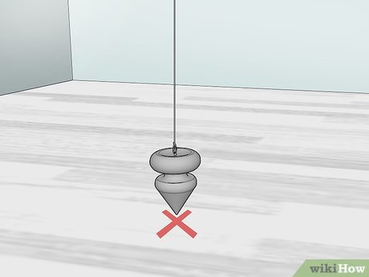

1 Mark the location of your center column using a plumb bob. A plumb bob is a type of tool used to check vertical building lines. Suspend the plumb bob by hand from a point directly above where you want the center column to go. The tool's weighted end will cause the attached cord to form a straight line from top to bottom. When the bob stops swaying, mark the indicated spot on the floor of the lower level with a pencil.[11]

If you’re installing your staircase in an area with carpet, hardwood, tile, or laminate flooring, you’ll need to remove the flooring materials in order to expose and mark the subfloor underneath. Anchoring the center column of your staircase directly to the subfloor will help ensure maximum stability.

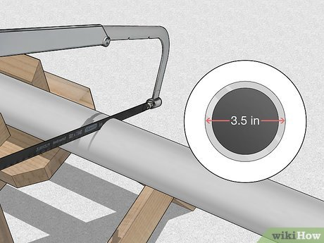

2 Cut a section of steel pipe to serve as your center column. Schedule 40 pipe with a 3–3.5 in (7.6–8.9 cm) diameter will work well for most projects. Mark the intended height of your staircase on the edge of the pipe, then use a circular saw equipped with a carbon-steel saw blade or a rotary tool with a grinding disc to cut it to size.[12]

All-wood staircases may be constructed around a wooden post rather than a metal pipe.

If you opted for a modular spiral staircase kit, it will include a center column that’s been prefabricated to a length that matches the specifications of your home.

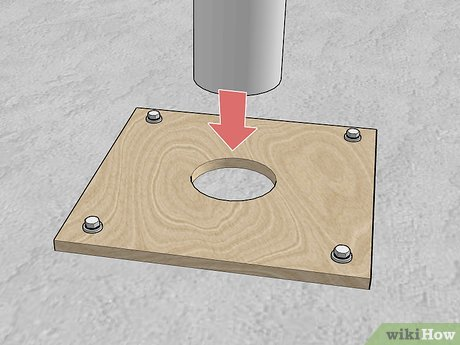

3 Anchor the center column to the subfloor using a wood or steel plate. To make your own base plate, cut a 1/2 in (1.3 cm) sheet of wood into a 12 in (30 cm) x 12 in (30 cm) square, then drill a 7/16 in (1.1 cm) hole in each corner to make room for 3/8 in (0.95 cm) wood screws or concrete anchor bolts. Drive a screw or bolt through each hole and into the subfloor to fasten the base plate and hold the center column in place.[13]

If you haven't already, pull up the flooring material in your work area to gain access to the subfloor.
Alternatively, you can purchase a premade steel base plate sized to fit your center column. These typically have slots for screws or bolts molded right into them.

In order to guarantee that your center column will support the weight of both the completed staircase and its future occupants, it’s important that you secure it directly to a floor joist or undamaged section of concrete subflooring.[14]

## Part 3  Assembling the Steps and Other Components

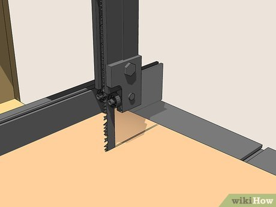

1 Trim a series of stair tread blanks to the necessary dimensions. Head down to your local home improvement center and purchase a set of stair tread blanks in your preferred material and finish. Make sure you have enough raw material to fashion the number of steps you calculated while planning your layout. Cut your treads using a bandsaw, remembering that they need to be at least 7.5 inches (19 cm) deep 12 inches (30 cm) inward from the narrow end.[15]

It’s a good idea to pick up 2-3 extra blanks in case you make a mistake while cutting your first couple treads.

If you plan on building an all-wood staircase, you’ll also be responsible for cutting your own stringers, balusters, handrails, and optional risers, all of which will require extensive woodworking expertise.[16]

> Tip: Creating a reusable paper template can make measuring and cutting identical stair treads much easier.

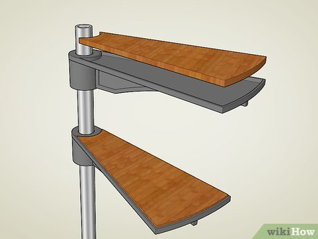

2 Use premade metal treads to simplify placement and installation. Premade treads are measured and shaped in accordance with national building codes, which means they can save you considerable time and labor. You can install them as-is, or top them with wooden covers in the same shape and size for a more natural look.[17]

There are many companies that manufacture premade treads designed specifically for spiral staircases.

If you’re working with a modular staircase kit, it should come with premade treads, tread covers, and spacers.

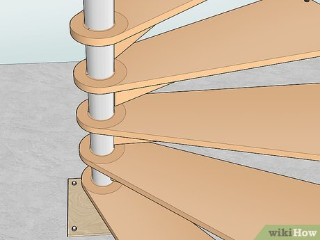

3 Arrange your treads around the center column in an overlapping pattern. Make sure that the front edge of every next tread hangs over the back edge of the previous tread by about 1 in (2.5 cm). This will provide a comfortable amount of foot room while ensuring that the stairs are safe to walk on. Position and secure each of your treads one at a time to complete the spiral formation at the upper-level landing.[18]

Fasten wooden treads by cutting a neck into the narrow end and screwing or bolting them to the center column. Depending on the style, you might anchor the wider ends to the outer stair stringer, as well.

Most premade metal treads are designed to be slid over the center column and tightened down. Some kits include alternating spacers to eliminate the guesswork involved in getting every step exactly the same distance apart.[19]

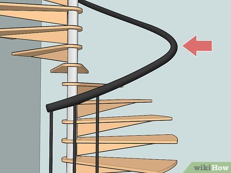

4 Attached a handrail to offer added stability to your staircase. Your modular kit should come with either a pre-curved handrail or a straight length of material with directions for cutting and shaping. Crafting a helical handrail from scratch is more difficult. The quickest way to do it is to shape a length of steel or another flexible metal manually by feeding it through a roller.[20]

Unless you’re skilled in metalworking and have access to specialized machinery, you’ll probably find it easiest to just purchase a handrail or have one made to your precise specifications.
Another common option for fabricating wooden handrails is to cut short curved sections from multiple pieces of wood.[21]

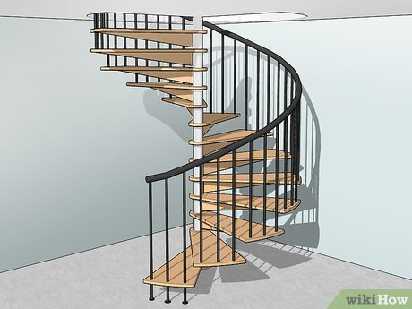

5 Install balusters between the treads and handrail at regular intervals. If you’re fashioning your own staircase components, you can drill holes every 4–6 inches (10–15 cm) into the outer edges of the treads themselves or adjacent stringers to fit your balusters of choice. With a modular kit, all you have to do is screw the rod-like pieces into their designated slots in the assembly. Once that's done, your spiral staircase will be complete![22]

Check to make sure all of your balusters are secure. A loose baluster is an accident waiting to happen!

Balusters are a functional touch as well as a decorative one—they enclose the sides of the staircase, which helps to prevent falls and other mishaps.
