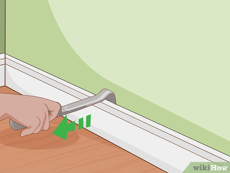
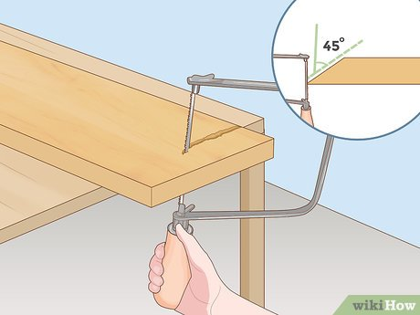
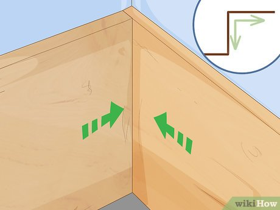
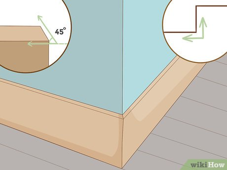
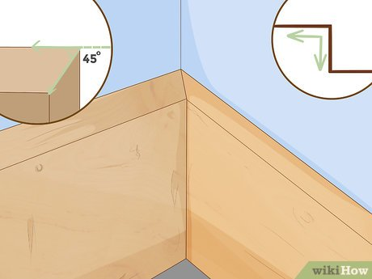
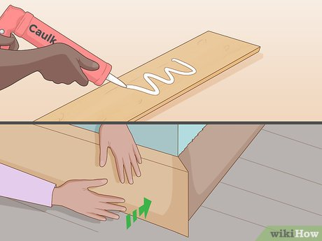
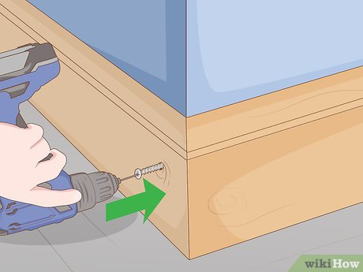
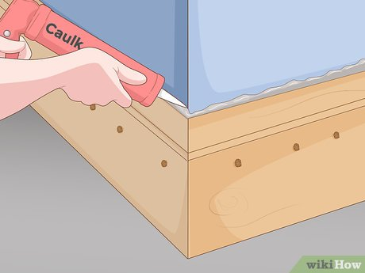

# How to Fit Skirting Boards: Measuring, Cutting, & Installing
Co-authored by Alberto DeJesus

Last Updated: March 9, 2023

Hoping to add some skirting boards to your room, or upgrade the ones you already have? This relatively easy DIY project makes it easy to add the finishing touches to any room. Regardless of the project, all you need are a few basic tools and supplies to do the project yourself. We'll walk you through everything you need to know, so you’ll be fitting skirting boards like the pros in no time!

## Part 1 Old Board Removal and New Measurements

1 Remove any old skirting board with a bolster chisel. Use a hammer to gently tap the blade of a bolster chisel between the skirting board and the wall. Insert a crowbar in the gap and gently pry the board away from the wall.[1]

Place a scrap piece of wood between the back of the chisel and the wall to avoid damaging it as you pry off the baseboards.

Work your way along the total length of the boards with this process until you can easily pull them away from the wall.

2 Use a tape measure to measure the walls you want to fit skirting board too. Stretch out your tape measure along the bottom of each wall and write down each measurement. Add them up when you finish to get the total length of skirting board that you will use.

You could draw a rough diagram of the room on a piece of paper and write down the measurements next to each wall on the drawing to visualize better.

3 Buy 20% more length of skirting board than you need for the room. For example, if the total length of skirting board for the room you need is 30 ft (9.1 m), then buy at least 36 ft (11 m) of board. This will allow for losses when you cut boards and end up with small pieces you can’t use.[2]

You can get your skirting boards from a home improvement center. They are also known as baseboards.

Use a calculator to multiply the length of skirting board you need by 1.2 to add 20%.

## Part 2 Cutting the Boards

1 Start with a wall with internal corners and cut square ends on a board. Measure the longest wall that has 2 internal corners. Use a pencil to mark where to cut on the back of a piece of skirting board to fit it on the wall. Use a miter saw to make straight cuts on the board so that it fits tightly between the internal corners.[3]

These are the easiest cuts to make, so get them out of the way first. This will give you a good starting point from which to fit the other skirting boards.

Use a miter saw for all cuts to make them perfectly straight.

2 Cut boards with a coping saw so they fit into the face of the 1st board. Cut a 45 degree angle on the end of a board that will slot against the square-edged board. Use a coping saw to cut away the excess. Follow the profile of the skirting board so that it will slot into the face of the other board in the internal corner.[4]

This process, called scribing, takes a bit of practice to get the boards to fit. Practice on a piece of scrap first to get the hang of using the coping saw to cut along the profile of the board.

3 Plan out your cuts so that you don’t need to scribe 2 ends of a board. For instance, for all walls with 2 internal corners, other than the wall you started with, cut 1 end of the boards square. Then scribe the end of the next board you cut to slot into the square end of the last board.[5]

It’s easiest to work your way around the room in a clockwise direction as you fit boards together.

4 Use a miter saw to cut boards at a 45 degree angle for external corners. Measure where the end of a board will reach an external corner and mark the back of the board where you will cut. Place the board in your miter saw with the back facing you and cut the 45 degree angle so that the cut is on the back of the board.[6]

The back edge of your cut should be lined up with the corner of the wall.

5 Cut the next board for the external corner at an opposite 45 degree angle. Move the miter saw to the other side of its axis to cut the next board that will fit on the external corner. For example, if you cut the first board with your miter saw at a 45 degree angle to the left, now move it to a 45 degree angle to the right for the next cut.[7]

Fit the two boards together at the external corner and make any small adjustments to the cuts until they fit snug against the wall and each other.

Use a leveler to ensure that the two boards are level and perpendicular to one another.

## Part 3 Attaching the Boards

1 Attach boards to a plasterboard wall with instant-grab adhesive. Spread instant-grab adhesive in a zig-zag pattern on the back of the boards. Press them against the wall with the bottom edges tight against the ground. Wipe away any excess adhesive that seeps out of the edges.[8]

If you are installing new carpet or flooring, make sure to attach the boards after it is installed so they go in at the right level and tight against the new flooring.

Instant-grab adhesive is the easiest and quickest way to attach skirting boards to a plasterboard wall.

2 Screw the boards into the studs inside a plaster wall instead of using glue. Find the studs in the plaster wall and mark their position on the wall and on the skirting board. Drill a pilot hole into the board and countersink the hole with a larger drill bit. Screw the boards into place.[9]

It’s important to countersink the holes so that the heads of the screws are below the surface of the baseboard and you can cover them with wood filler.

3 Fill gaps with decorator’s caulk and cover any screws with wood filler. Use decorator’s caulk to fill any gaps between the boards and the wall or where the boards meet. Cover the heads of any screws with wood filler where you countersank them into the skirting boards.[10]

Make sure to wipe away any excess caulking or wood filler before it dries to get a smooth finish.

Let all caulking and wood filler dry completely before you paint the boards or walls.
