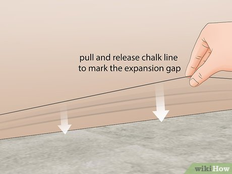

# How to Install Vinyl Plank Flooring on Concrete
Co-authored by Mitchell Newman

Last Updated: March 10, 2025 

Vinyl plank flooring is very durable and affordable.[1] It also fits over most surfaces, including concrete. Although the flooring comes in a variety of forms, planks are installable with a minimal amount of tools and measuring. The hardest part of the job is often cleaning and leveling the concrete base. After the concrete base is ready, lock the vinyl planks together to install your new floor.

## Part 1 Cleaning and Repairing the Concrete

1 Remove the baseboards if your walls have them. Use a sharp utility knife to cut through any paint holding the baseboards to the walls. Then, slide a putty knife behind the boards, prying them lightly to loosen them. Locate the nails holding the baseboards in place, then use a pry bar to pull them out of the wall.[2]

Pry the baseboards carefully to avoid damaging the walls. Work in sections, loosening the boards until you are able to remove them safely.

2 Chisel any cracks in the floor to clean them. Hold the chisel at an angle with the tip in the crack. Pound the back end of the chisel with a hammer to loosen any debris inside the crack. Hairline cracks need to be opened up a little to let in new filler material. Be very gentle when using the chisel to avoid making the crack worse.[3]

Another way to open up small cracks is with an angle grinder.

3 Clean the floor with a brush and vacuum. Pick up all debris off the floor before attempting to wash it. Then, sweep up dust and other debris with a whisk broom. Finish removing leftover debris with a good vacuum cleaner.[4]

Make sure you get any pieces of concrete chiseled out from the cracks.

4 Wash away stains with soap and water. In a bucket, combine about 1/3 cup (79 mL) of a neutral-pH laundry detergent with 16 cups (3,800 mL) of warm water. Spread the soapy water over the concrete floor and scrub it with a stiff-bristled brush. Mop the floor with clean water and let it air dry when you're done.[5]

The soapy water will remove most stains, but may not be effective on tough grease or oil stains. For these, use a commercial degreaser. Spread it, let it dry, then sweep it up.

If a degreaser doesn’t work, try cleaning the concrete with trisodium phosphate. Trisodium phosphate is harsh, so wear long-sleeved clothing, protective gloves, glasses, and a respirator mask.

5 Repair cracks in the floor with concrete filler. Get a bottle of concrete filler and cut the tip off of it. Hold the bottle close to the cracks and squeeze the filler into them. Move the nozzle along the cracks as you fill them to the top. Then, smooth the filler material out with a trowel.[6]

Another option is to use a tub of concrete patching material. Many of these products come pre-mixed. You spread the material over the floor with a trowel until cracks are repaired.

6 Use a carpenter’s level to find spots where the floor is uneven. Many of these spots represent significant damage to the floor, so they are visible by eye. If you’re unsure, a 6 in (15 cm) level will show you where you need to make alterations. If the level has fluid in it, it will move according to the floor’s tilt. Note spots where the floor is higher or lower than normal.

The concrete needs to be roughly level in order for the vinyl flooring to fit correctly.

For an easy time measuring the floor’s imperfections without a big level, use a laser level or run a string across the floor. Hold it taut and tie it to nails in the wall as you identify the uneven spots.

7 Sand high spots down with a belt sander. Place a 40 or 60-grit belt on the sander. Start the sander, pressing it against the elevated spots in the concrete. Wear these spots down until they’re level with the rest of the floor, then sweep and vacuum up the dust.[7]

The belt sander will kick up dust, so ventilate the area. Wear a respirator mask and protective goggles.

8 Fill in low spots with a concrete self-leveling compound. First, apply a concrete leveling primer to the entire floor with a push broom. Wait 3 hours for it to dry. Then, mix about 50 lb (23 kg) of the leveling compound in 20 cups (4,700 mL) of water. Pour the mixture onto the floor, letting gravity take it into the lower areas of the floor.[8]

To facilitate the leveling compound, spread it around with a squeegee or push broom. Make sure it forms a smooth surface as it dries.

Wait about 6 hours until the leveling compound has dried before attempting to install vinyl planks.

## Part 2 Measuring the Floor

1 Mark the center of each wall and draw chalk lines between them. Use a tape measure to find the center point of each wall. The easiest way to connect these points is with a chalk line tool. You load the chalk into the tool, then run the tool's string from nails placed in each center point. Pluck the string by pulling it up and releasing it to create the perfect chalk line.[9]

Chalk line tools, along with anything else you need to install vinyl flooring, are available online or at most home improvement stores.

2 Measure a small distance out from the walls to find the expansion gaps. Use a tape measure to measure out about 1/4 in (0.64 cm) from each wall. Mark these spots on the ends of each wall in pencil. These expansion gaps protect the vinyl as it expands and contracts due to temperature changes in the room.

Always keep a small gap between the vinyl and the walls in order to prevent the flooring from buckling.

3 Mark the expansion gaps with more chalk lines. Set nails in the marks you made, then string the chalk line tool between them. Snap the line against the floor to create guidelines for the expansion gaps. Remove the chalk line tool and nails when you’re done.[10]

Use these chalk lines as guidelines on where to place the planks. Keep them aligned with the outlines at all times for even, sturdy flooring.

4 Calculate how wide the last row of planks needs to be. Measure out the width of the vinyl planks you plan on using. Use that measurement to determine how many rows of planks you need to fill in the floor. Chances are that your floor space isn’t perfectly even. If the final row of planks is less than ⅓ the size of the other rows, plan on cutting the first row of planks by ⅓ to make them even.[11]

If you don’t cut the first row of planks down, then you end up installing a small and unsightly final row of planks.

The only way to get the planks even is by planning the floor layout out in advance. Otherwise, you have to undo the entire floor in order to cut down the first row of planks.

## Part 3 Laying the Vinyl Planks

1 Cut the tongue off the first row of planks with a utility knife. Each vinyl plank has a grooved side and a tongue side. The tongue is opposite of the grooved side, running along 1 of the plank’s longer edges. With the vinyl plank face up, hold a straightedge next to the tongue. Score the plank with the utility knife, then bend the plank to break off the tongue.[12]

Vinyl planks don’t have an adhesive backing. Locking them together is enough to secure them in place.

Unless you need to cut vinyl to size to match the last row, you only need to cut the edges off the first row of planks.

2 Lay the first row of planks parallel with the longer side of the room. Place the planks along the chalk guideline close to the wall. Make sure the ends you scored with a utility knife face the wall. To connect the planks, hold the second plank up at a slight angle against the edge of the first plank. Lower it until it clicks into place.[13]

Always lay the planks parallel with the longer side of the room. Start on the left side of the room, if possible, and run the planks towards the right wall.

3 Score and cut the last plank in the row to fit against the wall. When you reach the far wall, measure how much space you have left. You probably won’t have enough room for a full plank. Measure the distance out on the plank, score it with a utility knife, then bend it to break it to size. Snap the plank onto the row of planks, aligning it with the chalk guidelines.[14]

The final plank in the row needs to be at least 6 in (15 cm) long. If you don’t have enough space, go back to the first plank in the row and cut it down to make the end planks even.

4 Fit the next row of planks into the grooves on the first row. Start on the left side of the first row of planks. Position another plank under the first plank. Hold it up at an angle, pushing the tongue into the first plank’s groove. Then, push it down to snap it in place.[15]

The grooves on the second row of planks will face outwards to connect to the next row. All subsequent rows of planks connect the same way.

5 Connect the remaining planks by joining the shorter ends first. When laying subsequent planks, connect them with the previous plank in the row first. Hold the plank up at an angle, attaching it to the previous plank. Then, fit the plank’s tongue into the groove on the plank above it. When you feel the plank lock in place, lower it to the ground.[16]

Make sure the planks lock together like puzzle pieces, or else they will come out of alignment as you move on.

6 Stagger the joints in each row by 6 in (15 cm). The joints are where the planks in each row connect. It’s easy to line up the joints in each row, but this weakens the floor. Position the floorboards in the second row so the joints do not align with those in the first row. Do this for every new row.[17]

The joints are the most vulnerable part of the floor, so staggering the joints strengthens the connections between the panels. It also makes the flooring look better.

7 Bend and tap the flooring to fit it under door jambs. Jambs or door frames stick out from the wall a little bit, so they will likely extend beyond the chalk guidelines you made. To remedy this, bend the panel upwards towards you as you slide the end towards the jamb. Then, hold a tapping block against the plank’s back end and hit it with a hammer to push the plank into place.[18]

You may need to cut the planks to fit around door jambs, especially when the planks run perpendicular to the doorway.

8 Replace the baseboards when you’re done installing the planks. Check the old trim to make sure it isn’t cracked or rotting. If it’s still good, it is safe to use on the wall. Set it up so it’s flush with the wall and the vinyl planks. Nail the baseboards to the wall studs with finishing nails.[19]

Installing new baseboards is another project. You will need to buy new boards, measure out the length of the wall, and saw the boards to fit over the vinyl.
