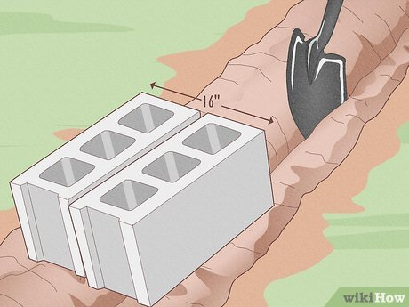

# How to Lay a Block Wall with Cement or Cinder Blocks
Co-authored by Gerber Ortiz-Vega and Hannah Madden

Last Updated: October 21, 2024

Are you starting the foundation for a large structure or building a retaining wall? If so, you’re probably preparing to lay some concrete blocks. Laying concrete blocks is a simple project, even for beginner DIYers. In this article, we’ll walk you through the entire process, including what tools you need and what type of blocks to get. To start your project today, read on.

## Things You Should Know

Before laying cinder blocks, pour a footing below the frost line. The footing is the foundation for the concrete blocks.

Let your footing dry for at least 3 days before laying concrete blocks. Start with corner blocks, and use mortar to keep them in place.

Place a wooden stake in each corner of the footing, and use a string line wrapped around the stakes to make sure your blocks are straight.

Stack the blocks on top of each other in an alternating pattern on top of the footing. Apply mortar to the sides of each block before stacking them.

## Part 1 Pouring the Footing

1 Dig below the frost line. The footing is the solid concrete perimeter that your concrete blocks will sit on. Check with your county to see how far down the frost line is, then dig beneath that line to start your footing.[1]

Be sure you’re not going to dig through a utility line as you start your project. In the United States, call 811 to see which utility lines are on your property.

Your local building codes may also specify how deep the footing needs to go. Typically, you need to make your footing twice as deep as the thickness of the wall.

2 Make your footing twice as wide as your concrete blocks. If you're using standard blocks, which are 8 in (20 cm), make your footing at least 16 in (41 cm) wide. Dig the perimeter where your concrete wall is going to go that’s at least twice as wide as your blocks.[2]

To ensure you’re digging in a straight line, snap a chalk line onto the ground to create your base shape.

3 Place 2x4s in the hole to keep the concrete in place. Grab eight 2x4s and place them inside of the hole that you dug for the footing. Use the 2x4s around the perimeter as a guide to hold the concrete in place while it dries.[3]

Make sure that the 2x4s are flush with the top of the hole that you dug. That way, the concrete won’t spill out of the top.

4 Pour the base concrete. Mix a batch of concrete in a wheelbarrow with a shovel. Fill the frame that you just dug up to the edge. Level the freshly poured concrete by running a 2x4 across the top, and fill any spots that are low with additional concrete.[4]

For a large retaining wall, consider renting or hiring a concrete mixing truck to come and pour the concrete for you.

5 Wait 3 days for the footing to dry. Before you can begin building, you'll need to give the concrete ample time to dry. Building on wet concrete can lead to sagging, and your concrete wall may not be as sturdy as it needs to be.[5]

## Part 2 Laying Concrete Blocks with Mortar

1 Section off the corners with wooden stakes. Before you begin laying the blocks, visualize all the corners of your frame. Place a wooden stake in each corner, and use a cord or string to tie off exactly where the corners’ edges will be. Attach a cord or string to the wooden stake used to mark the corners and lay out a perimeter.[6]

2 Mix cement mortar with water. Take the bag of dried concrete, and look at the bag's specifications to find the ratio of mortar to water. Use a 5-gallon bucket or a wheelbarrow to mix the mortar with a shovel until it’s thick and paste-like.[7]

Type M mortar is the strongest mortar mix out there, so it’s ideal for this project.

Use a drill and a mortar mix drill bit to make this process easier.

Try not to mix more mortar than you can use. Mortar dries out quickly, and any extra mortar you have will need to be thrown away.

Wear protective glasses, gloves, a ventilated mask, and long jeans.[8]

3 Spread the mortar along 1 corner of the footing. Use your trowel to spread a few slabs of mortar around the corner's base of the footing. Spread the mortar 1 in (2.5 cm) deep and 8 in (20 cm) wide in the marked area. Continue to spread the mortar to account for the distance of about 3 to 4 blocks.

You may notice that the mortar falls off your trowel quickly, which can be frustrating. To keep it contained, scoop mortar up with your trowel, then tap the flat side of the trowel onto a flat surface. The remaining mortar will be thin and stick to the trowel until you’re ready to apply it.

4 Center the corner block on the footing. Stand over the footing and gently set the concrete block down, making sure it’s level and flat. Center the corner block in the footing by measuring around the block and making sure it’s even.[9]

Use your string to make sure your corner block is level and in a straight line.

5 Continue to lay the concrete blocks in a line out from the corner. Start laying blocks from the corner or edge of the wall to work in one direction. Apply a 1 in (2.5 cm) thick layer of mortar to the sides of each block as you go. Keep laying blocks and applying mortar until you reach the next corner.

Apply mortar at the end of the block before you place the block adjacent to it.

6 Check the alignment of the blocks with a level. Before stacking more concrete blocks on top of your initial foundation, check if everything is aligned.[10] Use your mason's level by laying it on the first set of blocks. Check both the outside and center section of the bricks.
Tap the blocks for any alignment adjustments while the mortar is still wet.

Do not try to move a block after the concrete has set, since that could make your wall unstable.

7 Apply mortar to the top of the blocks. Use your trowel to spread 1 in (2.5 cm) of mortar over the entire width of the block.[11] Then, spread the mortar so it covers the length of about 3 blocks in the direction that you are laying the bricks.

Keep the mortar on the sides of the blocks so that it doesn’t fall into the hollow center. It won’t hurt your retaining wall, but it will just waste your mortar.

8 Stack the blocks on top of each other. Lay the block down on top so the edge of the top block aligns with the halfway mark of the bottom block. You'll recognize the pattern as a standard among the construction sites. The top block will fit in between 2 bottom blocks.

Use a level every 2 to 3 layers to ensure your wall is flat. If not, remove bricks from the uneven layer and try again.

9 Add reinforcement rods for high walls. If you’re building a house or a large shed, consider adding reinforcements. You can also use reinforcements if the ground pressure on the site is not stable. Place the 1/4" steel reinforcement rods into each opening of the concrete blocks.[12]

10 Strike the mortar joints. The mortar joints are the spaces between the bricks that are filled with mortar. Once the mortar mix has set enough so you can leave a thumbprint in it, run a concave jointing tool along each joint to remove the excess mortar. Start with the horizontal joints, then move to the vertical joints.[13]

For best results, move across each joint 2 times, and keep your tool wet.

There are several different joints to choose from, but the concave joint is the easiest to do for beginners.

11 Wait 24 hours for the mortar mix to cure. Mortar mix will start drying within 20 to 40 minutes, but it’s best to wait at least 24 hours before adding anything on top of your walls. After 1 day or so, the mortar mix will be mostly cured, and it will be strong enough to support other construction materials.[14]

Mortar mix can take up to 28 days to reach its full cured strength.