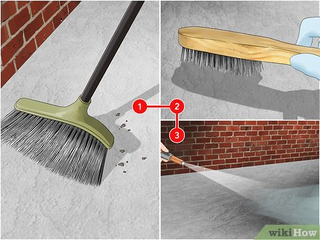
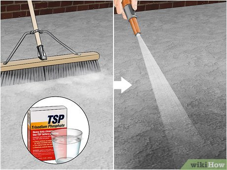
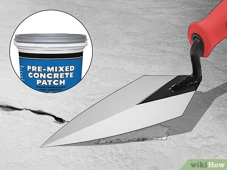
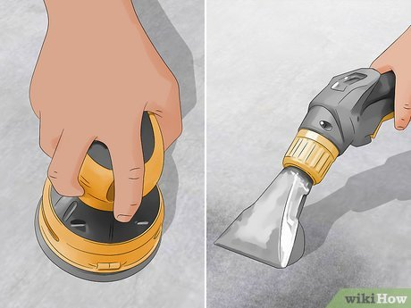
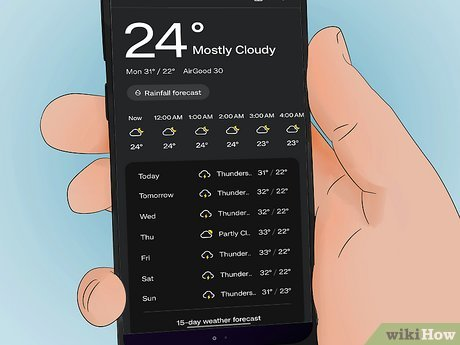
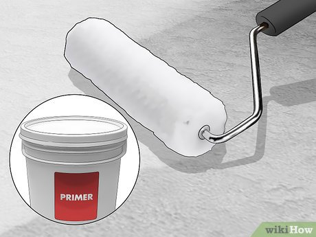
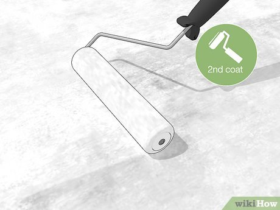
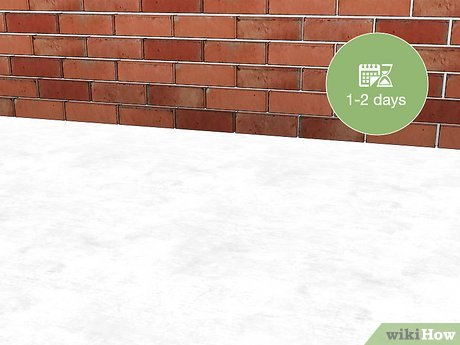
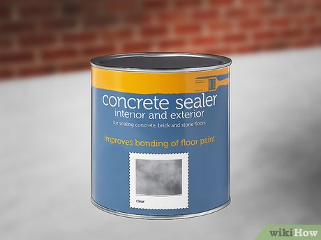

# How to Paint Indoor or Outdoor Concrete

Co-authored by Andre Kazimierski and Eric McClure

Last Updated: March 5, 2025 

There are no rules that say you’re forced to keep concrete surfaces that dull old gray. Why not spruce things up with some color?! Painting concrete is a simple and inexpensive project that anyone can complete in a weekend. But that doesn’t mean you can automatically break out the brush and roller all willy-nilly. In this article, we’ll break down all of the tips, tricks, and hacks you’ll need to know to get the smoothest and most elegant finish possible.

## **Things You Should Know**

Prepping your concrete is arguably more important than the painting itself. Clean the surface thoroughly to ensure the paint adheres properly.

Apply a concrete primer to the surface to ensure that the paint sticks to the concrete uniformly.

Once you’ve painted the concrete, apply a masonry sealant to ensure your paint job holds up over time.

## Part 1 Prepping the Concrete

1 Clean the concrete surface with soap and warm water. Sweep away any leaves, debris, and dirt with a broom. Then remove any existing paint or gunk using a power washer or scraper and wire brush. Scrub away any dirt, grime, or gunk that is stuck to the concrete. Yank off any vines, moss, or other plant life covering the concrete.[1]

You do not have to worry about stains, since the paint will cover them up.

The goal throughout this entire prepping process is to get the surface as clean and bare as possible so that the paint adheres properly.[2]

2 Remove oil and grease with TSP to ensure that the paint sticks. TSP, which is short for tri-sodium phosphate, is a semi-corrosive cleaner designed specifically for tough surfaces like concrete. Put on a respirator, long sleeves, gloves, and protective eyewear. Mix the TSP with water in the ratio illustrated on the packaging and wash away any oil stains, rinsing the cleaner off when you're done. Allow the concrete surface to dry.[3]

If the concrete isn’t exceptionally dirty, skip the TSP treatment. It’s relatively difficult to deal with so far as cleaners go, and it’s much easier to just rinse the surface with soap if you can.[4]

TSP is probably a little bit of overkill for an indoor paint job, but you can use it either indoors or outdoors if you’d like.

3 Apply concrete filler to any cracks or damage. If there are any breaks or cracks and you don’t fill them, moisture will get into the concrete and eventually cause the paint to peel. Apply the filler with a caulk gun or via the applicator that came with the filler and wait for the filler to dry.[5]

It typically takes roughly 3 days for concrete filler to fully cure, but read your product’s instructions for specific drying times.

Once the filler is dry, sand the surface to remove any excess filler if it isn’t flush with the surrounding concrete.

4 Sand and vacuum the concrete if it’s uneven or jagged. If you’re painting a concrete floor and it isn’t uniform, grab an orbital sander and wear down any especially uneven areas. Once you’ve got a smooth surface, run a vacuum over everything one more time to lift up any dust or dirt.[6]

## Part 2 Applying the Paint

1 Check the weather forecast if you’re painting outdoor concrete. Paint on concrete requires ample time to dry. Different paints will have their own, specific drying times so always check the manufacturer's instructions. Still, basically every paint product will require hours of drying time, so don’t choose a week with questionable weather.[7]

Purchase paint designed specifically for concrete. Do not use standard interior paint. Concrete is extremely porous, and the concrete paint is thick enough to fill in the larger gaps in the material.

2 Apply 1 layer of concrete paint primer with a paint roller. Before adding your color, apply a layer of primer to ensure that the paint will stick. Again, follow the manufacturer's instructions to confirm the necessary application and drying time. Use a brush to cut the corners and edges, then use a roller to fill in the larger surfaces.[8]

If you are painting over an old color or you’re working outdoors, apply 2 coats of primer. Let the first coat dry fully before applying the second.

3 Apply a second coat of paint once the first coat is dry. Once the paint has dried, apply a second layer the exact same way you applied the first coat. Cut the edges using a paint brush and then fill in the larger, flatter sections of the surface using a roller.[9]

4 Let the paint dry for 1-2 days before stepping on or placing anything on the concrete. Dry the final coat of paint for at least 24 hours before moving items onto or near the newly painted concrete to ensure a smooth, professional appearance.[10]

5 Seal the concrete to protect the paint and prevent moisture issues. If you want to ensure your paint lasts as long as possible, purchase a masonry sealant and cover your painted concrete with it. Use a clean paint brush and a roller to apply the sealant and wait for it to dry. Follow the sealant manufacturer's instructions for the unique instructions when it comes to the preparation and application of the product.[11]

You can skip this step if you’ve painted an interior wall that won’t get exposed to very much, but it’s probably mandatory for concrete floors and exterior surfaces.
