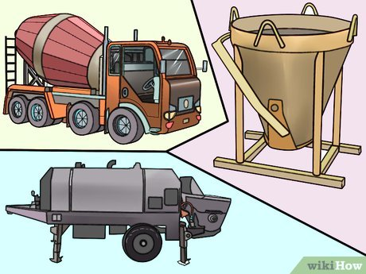
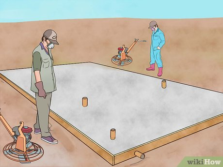

# How to Place and Finish a Concrete Floor
Co-authored by Gerber Ortiz-Vega

Last Updated: March 4, 2024

Whether building a home or an aircraft hangar, placing the slab changes the direction of your construction efforts. Before the slab is finished, the work crew is installing underground utilities, grading the site, and preparing footings, and generally working on a horizontal plane. Most construction doesn't really begin to move upward until after this step is completed, and this article will show you how it's done.

## Steps

1 Prepare the area where the work will be done. Heavy equipment may be used to clear the footprint of the building, plants and unsuitable material should be removed, and the subgrade should be inspected to determine if it will give adequate support for the slab and the structure that will be built on it.

Have the site surveyed or layout the building lines yourself. Batterboards may be used, or corner stakes can be set to allow building lines to be pulled and grades to be established for clearing and grading.

Grub out trees, bushes, and other plants, including their roots so they will not leave voids in the subgrade when they decay.
Remove any mucky or otherwise unsuitable material from the subgrade.

Proof roll or use another method to compact the disturbed subgrade soil material.

2 Form and place any concrete foundations which will be below the slab. For monolithic slabs, there may simply be a turn down edge, but for many buildings, a spread footing is poured, then CMU (concrete masonry units, commonly called block) are layed up to finished floor grade.

3 Set the forms for your slab. Building lines which have been laid out on the outside building line and on grade (at the proper elevation), will allow you to form the edges of the slab straight and level.

4 Install any roughed in plumbing or electrical pipes, as well as sleeves for air conditioning piping and wiring. Bathtub drainpipes and commode flanges are often blocked out so the traps can be installed when the fixture is set into position later.

5 Fill the slab area with a suitable material to finished grade.

Capillary fill is used where moisture may create a problem.

Crushed limestone or other aggregate base materials can be used for slabs with heavy loads like warehouse floors and aircraft hangars.

Cohesive materials like clay are sometimes used where the subgrade cannot be sufficiently stabilized using conventional methods.

6 Compact and finish grade the fill material. For engineered buildings, testing the density of the fill may be required to meet the architect's specifications. This is usually done by a geo-technical engineering laboratory.

7 Pretreat the fill and subgrade for insects using an approved and labeled termiticide. This is usually done by a bonded and licensed pest control company.

8 Install the required moisture barrier or waterproof membrane immediately after the termiticide is applied. This will help prevent the chemicals from evaporating, and will prevent the subgrade from drying out and becoming loose.

9 Install the reinforcing wire or rebars required by the architect/engineer or your local building codes. Make sure it is supported so that it will be positioned in the correct location after the concrete is placed and has set. Using concrete chairs is an effective method of doing this.

10 Plan the method you are going to use to screed the concrete. For wide spans, you will want to set grades or some type of screed guide to allow the screed operators to keep the concrete flat, or at the required slope. Pipe screeds are used in the placement shown in the photographs, but other techniques may be used, including grade stakes, or using a laser level and target to set wet screeds.[1]

11 Determine the method you will use to place the concrete in your forms. This should be done early in the process so that concrete trucks and other required equipment will be able to get into the area they will need access to during the concrete placement.

Aerial pumps can place concrete to specific areas of the slab via an articulated boom and hose assembly up to 120 feet (36.6 m) from the concrete truck. They are often used for placing concrete on elevated decks or in inaccessible locations.

Line pumps also use pipes and hoses to move the concrete from the truck to the placement location, but require a lot of labor to move the hoses around while in use.

Concrete buckets can be used for placing the concrete in high locations or inaccessible areas using a crane or forklift.

Georgia buckets are self-propelled wagons that can maneuver in tight locations to place concrete.

Chuting or tailgating is discharging the concrete directly from the truck into the form.

12 Check forms for alignment and make sure all braces are tight and well anchored so the weight of the concrete does not cause them to bow or fail during the pour.

13 Calculate the quantity of concrete you will need to complete the slab. Measuring the length times the width, then multiplying it by the depth, in feet or a decimal fraction thereof will give you the total cubic feet of material required. To convert this number to cubic yards, divide it by 27. Allow enough extra concrete to fill any monolithic footings, depressed slabs, and low areas in the fill material.[2]

14 Order the concrete from a ready mix concrete supplier, and schedule the delivery to coincide with the concrete placement schedule. This means both the date and time of the pour, and the interval of delivery for multiple trucks to arrive on the job site so the concrete crew has time to discharge and tend to each truckload, while not having to wait for the next truck to arrive.

15 Coordinate concrete testing with a qualified testing laboratory if the construction contract requires it. Testing labs often perform the following tests:[3]

Slump. This test determines the plasticity of the concrete material. A vertical cone shaped mold is filled with concrete and the amount the concrete slumps is measured, to make sure it is not too wet to meet specification for the job.[4]

Temperature. Concrete suffers detrimental effects when it becomes too hot, so the temperature of the product is monitored during placement.

Air entrainment. Chemicals are added to the concrete to ensure air is entrained in the mixture. These tiny voids will allow the concrete to expand and contract more before cracking when concrete is expected to be subjected to large temperature variations over time. A typical air entrainment requirement is 3-5%.

Compressive strength. Concrete strength is measured in PSI (pounds per square inch), and special plastic molds are used to collect samples of the material which are later used in the testing lab's laboratory to determine the concrete's strength.[5]

16 Plan on beginning large slab placements as early as possible to allow time to complete the project successfully. Things to consider are these:

Make sure you have sufficient manpower to perform the job.

Check the weather conditions. These factors can contribute to concrete setting times:

Temperature. The higher the temperature, the faster the concrete will set, and very hot conditions will affect the ability of the workers to perform.

Humidity. Very low humidity will allow for the water in the concrete to evaporate more quickly.

Wind. Wind can increase the speed the surface of the concrete will dry.

Cold weather can greatly increase the setting time for concrete. Placing concrete at near freezing temperatures or when freezing conditions are expected during the next 48 hours is not recommended.

Sunshine. Concrete will set more quickly in bright sunny conditions than it will in cloudy conditions.

17 Set up all equipment used in the concrete placement on the day of the pour.

If a concrete pump truck is to be used, have it arrive an hour or so early to allow it to be set up and in position, and to let the pump operator get an idea of the placement plan.

Service troweling machines, including checking the controls, the blades, and making sure they are full of engine oil and gasoline.

Check straight edges, screed boards, power screeds, and bull floats to make sure they are in good condition.

Make sure concrete vibrators are in good condition if the slab requires their use.

Check personal safety equipment, such as gloves, rubber boots, and eye protection.

Clean and check all hand tools so they are in good working condition.

18 Begin the concrete placement at a corner and continuing placing the concrete along the grade or screed lines as you have established. Concrete can be placed in parallel sections as long as each subsequent section is placed before the prior section has begun to set up, or there will be cold joints between the two.

19 Make sure the reinforcing wire mat or rebars are not forced to the bottom of the concrete while placing. If needed, have a worker or two walk with the persons placing the concrete and use hooks to pull the wire up. Keeping the reinforcing in the proper position is critical to the strength of the slab.

20 Keep placing the concrete and pulling it roughly level with Come Alongs and screeding it off with a straightedge or power screed. Have finishers work around electrical conduits and plumbing pipes with hand tools to keep the surface level.

21 Have one or two finishers, as the job requires, to bull float the concrete after it has been screeded. The person who bull floats the concrete may need a laborer to add concrete to any low areas he notices while performing this task.

22 Give men the job of using hand floats the job of working the edges of the slab. This is the process of moving around the edge making sure the perimeter of the slab along the forms is flat and smooth. This is especially important if braces are anchored on top of the form, or if the forms are not flush and level.

23 Remove pipe screeds or grade stakes as each area is placed and screeded off. If there is a hole left in the concrete when the screed or stake is removed, shovel additional concrete into it to flush it with the surface of the screeded concrete.

24 Continue pouring the concrete until the forms are filled to the finished grade of the slab. Once the concrete has been completely screeded, give someone the task of cleaning the tools used for placing the concrete, including the pipe screeds, bull floats, comealongs, and shovels.[6]

25 Allow the concrete to set. If the edges have been properly floated, and the bull floaters have done a good job with the main areas, you will want to have the crew wait until the concrete gets hard enough to support workers on knee boards before continuing the finishing process. Check the concrete by pushing it with your gloved finger until it is unyielding.

26 Have concrete finishers get on knee boards to work areas where a power trowel (troweling machine) cannot be operated. Working around blocked out areas, pipe stub ups, rebar dowels, and other obstacles will often require considerable effort.[7]

27 Set your troweling machine on the slab when the concrete is hard enough to support the workman without leaving deep footprints in its surface. Waiting too long will mean to concrete is too hard to achieve a very good finish, but starting too early will mean the blades of the machine may dig into the concrete causing rutting, humps, and other problems.

28 Trowel the concrete with the blades at their flattest setting. This gives them more surface area, so they will not tend to sink in as they spin across the surface. Using a combination type blade, rather than a finishing blade is better for this step.

29 Sprinkle a light mist of water on areas that do not respond to the troweling machine, particularly to help pull grout up to fill voids and cover any aggregate left exposed during bull floating.

30 Let the concrete continue to set after it has been troweled the first time. If the surface is flat and free of defects, you can allow the concrete to harden until it is ready for the finish troweling. Because the concrete is placed in a continuous operation, the first area that is poured will normally set up first, but be aware that areas exposed to hot sun or wind may get hard earlier than areas that were placed in a shaded, protected location.

31 Run the troweling machines over the concrete until the level of finish you desire is achieved. For a hard troweled finish, you will raise the blades up on the machine as the concrete gets progressively harder, which in turn puts more pressure on a smaller area of the blade.

32 Apply a curing compound or use a curing technique to keep the concrete from drying too quickly, especially in extreme weather conditions resulting in rapid evaporation.[8]

33 Saw any joints required by the construction plans.

34 Remove the forms and clean them for reuse on the next project. Make sure to remove any nails or screws that may present a hazard to workers handling these materials.
