# How to Repair a Flat Roof
Co-authored by David Bitan

Last Updated: February 24, 2025 

Flat roofs, which are mostly level, are common on older homes and in arid environments. These roofs work well, but you do need to inspect them on occasion for cracks and other signs of damage. Most flat roofs are made of asphalt, rubber, PVC, or another synthetic material. Rubber and synthetic membranes are often simple to fix with adhesive patches, while asphalt can be repaired with caulk or resealed with bitumen. Unless your roof is in very bad shape, diligence with repairs prevents extensive damage and gives your roof a longer lifespan.

## Method 1 Locating Roof Damage
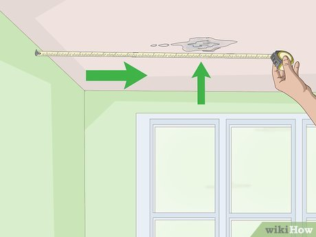

1 Determine how far the leak is from the 2 closest walls. Finding damaged areas on a flat roof can be tricky because the water tends to drip some distance before you see it. To get an estimation of where leaks stem from, go inside your home. Find spots that look wet or discolored from water damage, then use a tape measure to determine their relative positioning under the roof.[1]

For example, if the leak is 15 in (38 cm) from one wall and 20 in (51 cm) from the other, look in a similar area on the roof.

You may also detect leaks by sensing a damp, wet smell when you’re indoors after a heavy rain. Leaks need to be repaired right away to avoid catastrophic damage to the roof.

2 Examine the roof’s slope above the area you measured. Get a sturdy ladder and climb onto your roof. Be careful, since being on the roof can be dangerous, especially during icy winters. Go above the leaking area and search around it, trying to determine how the water could flow down the roof and into the rooms below.

Most flat roofs aren’t perfectly flat. They often slope slightly to drive water off the sides. That means water can seep into damaged spots higher on the roof and run down towards lower spots.

Have a friend hold the ladder steady for you. For additional safety, wear a harness and secure it to a chimney, temporary guardrail, or another anchor point.

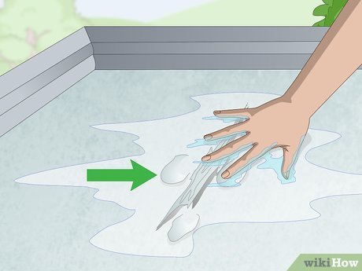

3 Identify any punctures, tears, or cracks in the roof. These spots should be pretty easy to identify. Any place that looks worn out can be responsible for water damage. The largest areas of damage are big problems that need to be patched up right away, but avoid overlooking small spots. Take care of them right away before they turn into bigger problems.[2]

Any spot that allows water in is an immediate issue. As long as water gets into the roof, the wood framework underneath will begin to rot and become unstable over time.

Patching these spots will preserve your roof for longer. Flat roofs generally last up to 25 years before needing to be replaced. If your roof is in bad condition, you may need to call a professional.

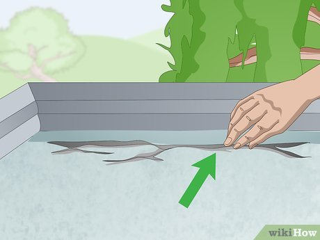

4 Check the roof’s seams for cracks and holes. If the roof’s membrane seems to be secure, the sides may be leaking. Look around the edges of the roof. Water can leak in through spaces between the roof and walls, vents, chimneys, or the metal flashing strips used to repel water.[3]

These areas can be patched up similarly to leaks in the membrane. A good roofing caulk will fill in any gaps or cracks.

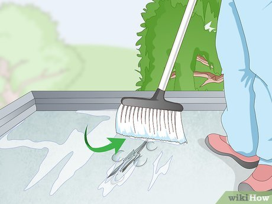

5 Sweep away water and debris from the damaged area. Always clean up any areas you wish to repair. Any leftover dirt, gravel, and water in the area can prevent the repair material from bonding to the roof. In addition, sweeping the area clear gives you a better view of the damage.[4]

To clear the roof, use a tough broom. Get as much debris off the roof as possible.

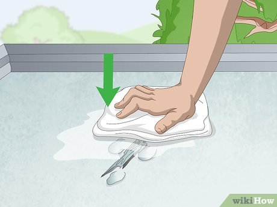

6 Dry any areas before attempting to treat them. To make effective repairs, always dry out the roof first. You only need to remove moisture from any areas you plan on treating with cement or sealant. Small areas can be dabbed dry with paper towels. You can also use a propane torch, but be very careful so you don’t accidentally light your roof on fire!

Waiting for sunny weather helps dry out the roof. If you need to treat a large spot or the entire roof, you pretty much have to give the roof a day or 2 to dry on its own.

## Method 2 Sealing Small Cracks and Holes

1 Slice open blistered spots with a utility knife. Blisters look like little bubbles on your roof. Pop the blister first by cutting into its center. Be careful to keep the cut shallow, since you don’t want to cut any deeper than the damaged portion. Scrape away the damaged roofing material.[5]

These spots happen due to trapped moisture and overheating. Check that the roofing underneath the blister is dry before you attempt to patch it. If it feels wet, dry it out first with paper towels.

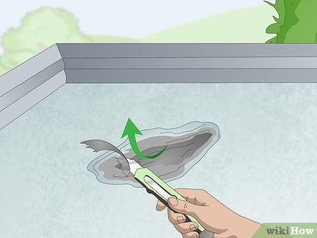

2 Cut around the damaged area until the membrane rests flat. For most small punctures, you can repair your roof simply by forcing sealant into them. Sometimes, doing that is difficult. Using a utility knife, make a shallow cut until you can remove material around the spot without damaging the layers underneath it.[6]

Use the damaged portion as a guide. Cut down until you are are underneath the damage, then stop so you don’t puncture the rest of the material.

You can lift cracked areas with a trowel. If the roofing material doesn’t lie flat, you should cut narrow strips around the crack until the area is level.

3 Spread a layer of roofing cement with a trowel. A good roofing cement fills in and waterproofs gaps on all sorts of different types of roofs. Push a layer of cement 1/8 in (0.32 cm) thick into the damaged area. Spread the cement about 6 in (15 cm) beyond the damage, then smooth it out with the trowel. You should no longer be able to see the crack or hole.

You can get roofing cement at most home improvement stores. Most cement comes in cans. Some sealants are available in caulk tubes which you can spread with a caulk gun.

Small holes and cracks no more than about 1 in (2.5 cm) wide can be sealed with caulk. Unlike cement, caulk is used to fill gaps. Cement functions as an adhesive, so it’s more useful if you plan on adding waterproofing material over a damaged spot.

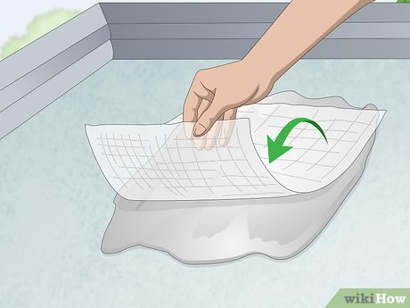

4 Lay a piece of fiberglass mesh over the cement. Fiberglass serves as extra waterproofing for your roof. It comes in rolls, so you will need to cut it to size using a sharp pair of scissors. Push the mesh down to hold it in place in the cement.[7]

You can usually find rolls of mesh at home improvement stores. Also shop at roofing supply stores or go online.

Fiberglass scrim is a type of lightweight tape that can be used in place of the mesh. It is good for sealing off long, straight cracks. After filling in the crack with caulk or cement, cover it with the scrim.

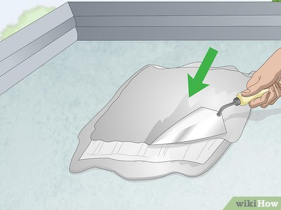

5 Cover the mesh with a thick layer of cement. Open up your can of roofing cement again and spread a layer of it over the entire piece of mesh. Smooth the cement flat with a trowel and add more cement as needed. The final layer of cement should be about 1/2 in (1.3 cm) thick and hide the mesh from view.[8]

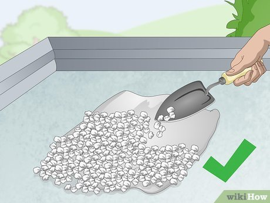

6 Add a layer of gravel over the cement to prevent sun damage. You may have seen rocks on flat roofs and wondered why they are there. A layer of gravel or river stones is often used to protect flat roofs from sun damage. Distribute the rocks evenly over the repaired area, making sure that no part of the roof membrane is visible beneath it. If the rest of your roof isn’t already covered, add stones to protect it.[9]

This layer of ballast absorbs UV rays, preventing sunlight from breaking down the bonds in the roof membrane. Your roof will last longer when it is full of gravel.

You can also purchase a can of reflective coating from a home improvement store and brush it onto your roof.

## Method 3 Applying Roof Patches
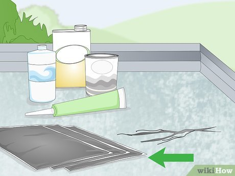

1 Get a roof repair kit to easily patch up your roof. Roof repair kits come with all the supplies you need to patch up a roof. Many of them include caulk for sealing cracks as well as patches for treating larger areas of damage on the roof membrane. Getting a kit means you don’t have to hunt down the individual components you need for a repair.

Match the patch to the type of roof you have. If you aren’t sure, you might want to call a professional to find out.

SBS roofing (styrene-butadiene-styrene) is asphalt that has a consistency similar to rubber. Use a torch on patch when repairing it.

For EPDM (ethylene-propylene-diene-erpolymer), use an EPDM patch. EPDM is a synthetic rubber made from oil and natural gas.

TPO (Thermoplastic Polyolefin) is a very white, single-ply rubber coating. Use TPO patches to repair it.

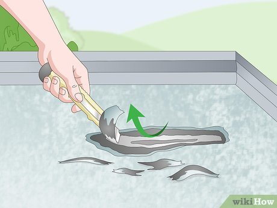

2 Cut out the damaged area using a utility knife. Locate the damaged spot you need to cover and begin planning how big you want the repair to be. Use the knife to cut a rectangle around the damaged part. Start by cutting about 1 in (2.5 cm) deep, then gradually make the cut deeper until you are able to remove the damaged roofing material.[10]

Be very careful when cutting. Avoid cutting deeper than the damage or else you will slice through the lower layers of material.

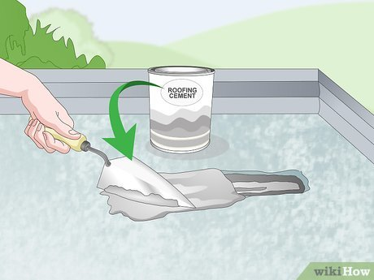

3 Fill the hole with a layer of roofing cement. Get a can of a waterproof roofing cement from the store. Most cans of cement work well for any roof, but you may want to check the label to make sure it is appropriate for the kind of roof you have. Spread out a layer of cement about 1/8 in (0.32 cm) thick, smoothing it out with a trowel until it is level with the rest of the roof.[11]

Spread the cement under the surrounding roof material as much as you can. Try to get it about 2 in (5.1 cm) beyond the damaged area.

Avoid using caulk when installing patches. Caulk is not meant to be an adhesive. Your patches will last a lot longer when cement binds them to the roof.

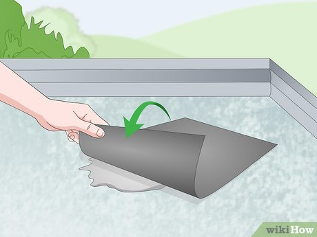

4 Set a patch on top of the cement. Take a single patch made of the same material as your roof. You shouldn’t need to cut it to the proper size, but you can do so with a utility knife so it fits over the damaged area. Fit the patch in place so it is even with the rest of the roof and press it into the cement until it sticks.

Some modern patches have peel-off adhesive backings. These patches do not need to be held in place with roofing cement, although you can still do this for additional security.

5 Coat the damaged area with a layer of roofing cement. Spread more cement to provide a sticking point for your new patch. Scoop the cement onto the damaged portion you covered earlier. Use a trowel to spread it into a smooth layer about 6 in (15 cm) beyond the damaged spot and 1/8 in (0.32 cm) thick. The concrete should be level with the rest of the roof.[12]

Be sure to spread the cement a little farther that you did the first time. Use the new patch as a guide to figure out where you need the adhesive to reach.

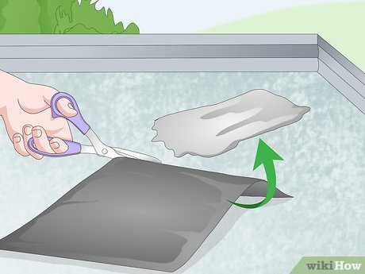

6 Cut a patch to fit over the cement. Double patch the damaged area to provide extra water resistance. The new patch should be both 6 in (15 cm) longer and wider than the damaged area, consistent with the last layer of cement you spread. Measure it out with measuring tape and cut it to size with a utility knife.[13]

Adding a second patch may make your repair more visible, but it is worth doing to make the repair stronger.

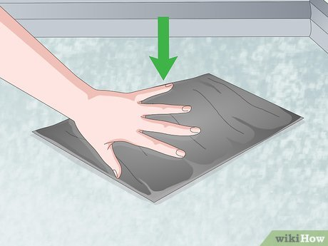

7 Set the new patch over the original patch. You know the drill. Place the new patch over the damaged area, pushing it down into the cement. It should hold fast. The new patch may be bigger than the area you cut out and hang over your existing roof material a little bit. Keep it as level with the rest of the roof as possible.[14]

Take the time to make sure the edges of the patch are secure to the older roofing material or else water may get underneath it. If they don’t stick, make sure the patch is dry. Get more cement under the edges and weight them down.

8 Cover the patch in a final layer of cement. Scoop more cement on the new patch, then begin spreading it out with a trowel. The layer should be even with the rest of the roof and about 1/2 in (1.3 cm) thick. Then, clean up your material and leave the patch undisturbed so it becomes a strong, long-lasting part of your roof![15]

Replace any ballast on the damaged area such as gravel or stones. If you don’t have any, consider getting some to protect your roof from sun damage.

## Method 4 Resealing a Roof
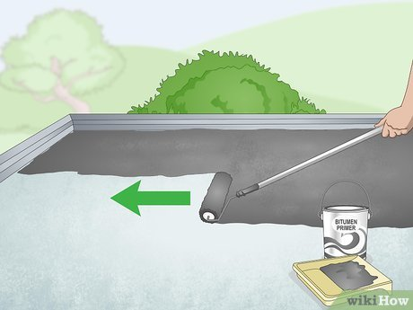

1 Brush a bitumen primer over the whole roof. Working on the entire roof is necessary if the waterproof seal needs to be renewed. Make sure the roof is clean before you begin. Then, get a bitumen-based primer and pour a little bit onto the roof. Use a paint roller to coat the entire roof evenly in a thin layer of primer about 1/2 in (1.3 cm) thick.[16]

You can get bitumen-based primers at most home improvement stores. Bitumen is a black, oil-based mixture found in a lot of flat roofs, especially asphalt.

A little bit of primer goes a long way. Pour out more if you see you need it. The amount you use will depend on the size of your roof. Expect to use about 1 US gal (3.8 L) per 100 sq ft (9.3 m2). You can calculate the roof’s area by multiplying its length by its width.

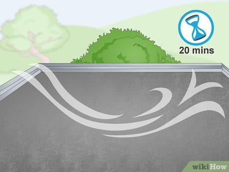

2 Allow the primer to dry for at least 20 minutes. The drying time depends on the weather in your area. On cooler, overcast days, this may take several hours. Read the manufacturer’s instructions for more information. The primer should be dry to the touch before you continue.[17]

Wet primer isn’t set, so any sealant you add on top of it won’t secure your roof properly.

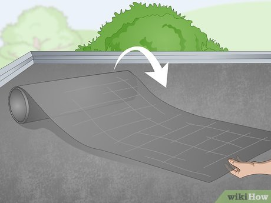

3 Roll a strip of fiberglass mesh over the roof. Mesh comes in large rolls. Larger rolls can be tough to get onto the roof, so get help if you need it. Starting on 1 end of the roof, roll the mesh out along the roof’s width. Using scissors or a sharp utility knife, cut it so it fits the edge of the roof. Make sure the mesh is level with the rest of the roof.[18]

Purchase mesh at a home improvement store. You don’t need the giant rolls unless you’re a professional constructing a big roof. Those rolls require a crane to lift, anyway.

Roofing mesh about 40 in (100 cm) wide should work for most roofing projects. Mesh rolls come in a lot of different sizes, so what you use depends on the size of your roof and what you are able to carry up to it.

You don’t need to cover the entire roof in mesh yet. Focus on installing the mesh 1 piece at a time.

4 Curl the mesh ends back and hold them to the center of the roof. Now begins the process of sealing the roof and mesh in place. To do this, gradually roll the mesh back up and clamp it down to ensure it doesn’t unfurl. Use something that isn’t sharp, such as a crowbar, paint can, book, or another weight. Work on the mesh 1 side at a time.[19]

Start with the end of the mesh that is opposite of your ladder. This part may be against a wall or otherwise difficult to access.

5 Mix a bitumen roof sealant until it reaches an even consistency. Bitumen sealants come in big cans that look like liquid tar. The solid material is at the bottom of the can. You will need a wood mixing stick to stir the material around. Work the sealant into a semi-liquid consistency that is easy to spread.[20]

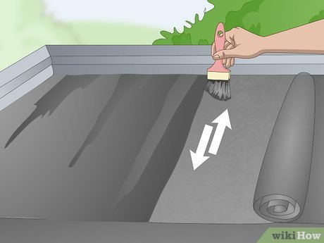

6 Paint the sealant onto the roof with a soft-bristle brush. Use a paint broom and dip it into the bucket of sealant. Start spreading the sealant at the far end of the roof. Work in 1 direction, placing the sealant where the mesh will lay once you roll it back out. The sealant should be in an even layer about 1/2 in (1.3 cm) thick.[21]

Once you have the sealant in place, start spreading sealant under the mesh’s other end. Roll up this end if you haven’t already.

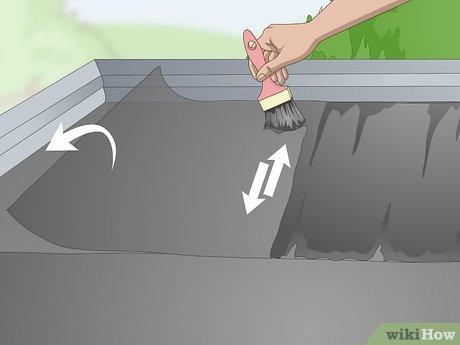

7 Coat the mesh with another layer of sealant. After spreading sealant on the roof itself, roll the mesh back out and press it flat with your feet. Dip your brush into more sealant and begin spreading it directly over the mesh. Coat the mesh in a layer of sealant about 1/2 in (1.3 cm) thick.[22]

It’s important to do this to seal out moisture and stick the mesh in place.

8 Continue installing mesh with sealant until the entire roof is covered. Roll out more mesh next to the first patch of sealant. Allow the mesh to overlap the old layer by 2 in (5.1 cm). Each piece of mesh should be level and even with the other pieces. Then, spread sealant the same way you did for the first roll of mesh.

Repeat this until your entire roof is covered. The amount of mesh and sealant you will need depends on the size of your roof.

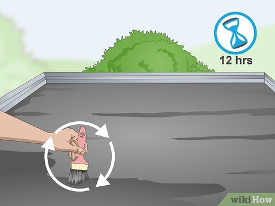

9 Add a second coating of sealant 12 hours later. Give the sealant plenty of time to dry, then come back and check your work. You will surely notice small, dark holes in the sealant. These areas aren’t waterproof and benefit from another coating. Spread another 1/2 in (1.3 cm) layer of sealant over the entire roof with your brush and then let it dry completely.[23]

Any holes should fill in right away with the second coating. Go over the entire roof to ensure you seal every spot.

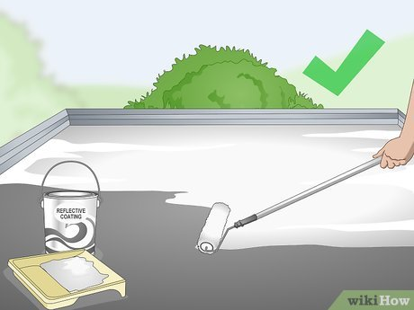

10 Add a reflective coating to the roof to protect it. Purchase a can of reflective coating and mix it to an even consistency using a clean stirring stick. Use a paint brush to coat the edges of the roof. Then, get a clean roller and spread the remaining reflective coating in a smooth, even layer over the rest of your roof.[24]

You can buy reflective coatings at home improvement stores. The coating is similar to rocks used in some roofs, blocking sunlight that can wear out your roof over time.

Expect the roof coating to take at least 8 hours to dry. It can take as long as 24 hours in cold or humid weather.
