# A Beginner's Guide to Stamping Concrete
Co-authored by Tony Hoang and Amy Bobinger, BA

Last Updated: January 20, 2025 

Decorative, stamped concrete is a beautiful and affordable alternative to natural pavers or plain poured concrete. The best part? You can achieve any kind of look you want—the sky is the limit! We talked to concrete and painting specialists to find out everything you need to know about stamping concrete yourself. Keep reading to learn how to stamp your own patio, driveway, and more.

## How to Do Stamped Concrete

1. Apply release powder to the concrete slab and the stamps.
2. Press texture skins around the edges of the slab.
3. Lay down a whole row of stamps, plus two more on the next row.
4. Walk along the stamps to tamp them down.
5. Move the stamps as you go to stamp the whole slab.
6. Use a chisel, concrete wheel, or grinder to do any detail work.
7. Seal the concrete and let it cure.

## Pouring & Preparing the Concrete for Stamping
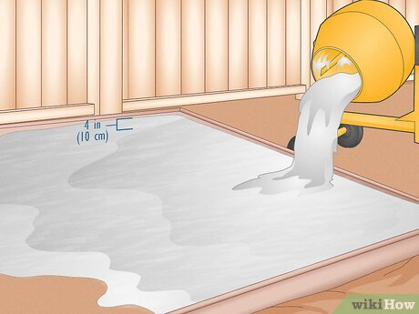

1 Mix and pour the concrete.

Hardscape specialist Sina Kamran says to properly pour concrete, start by excavating and grading the base layer. Then, build the concrete form, add steel bars or steel mesh as reinforcement, and pour the prepared concrete into the formwork.

You can only stamp newly-poured concrete—it can’t be an existing concrete slab.

Your concrete needs to be at least 4 in (10 cm) thick in order to stamp it.

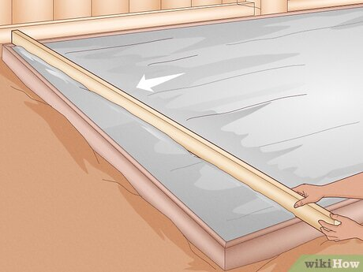

2 Screed the concrete to level it.

Landscaping specialist Tony Hoang recommends, “After filling your formwork, use a broad, flat object like a 2 x 4 (5.1 x 10.1 cm) board to compress the concrete and smooth out any clumps, gaps, or irregularities. Start in one corner and work across the entire area with long, sweeping strokes, but don’t press down too hard or move too quickly.”

Hoang says this will result in a “flawless surface that’s resistant to cracking and crumbling.”

3 Dust the skins and stamps with powder release.

Use a large masonry brush to apply a generous layer of powder release to the entire surface of each texture skin and concrete stamp. This will make it easier to remove the mats from the concrete without messing up the design.[1]

Skins are flat pieces that add texture to the concrete, while stamps have deeper grooves that form the outline of the design. The skins and stamps may be sold together, or you may need to purchase the skins separately.

Release powder comes in a variety of colors. Most of the release powder will be rinsed away after you’re finished stamping the concrete, but some will remain, giving the finished slab a marbled look.[2]

4 Broadcast powder release across the slab.

Dip your masonry brush into the powder release again and use the brush to toss (or broadcast) the powder release evenly across the whole surface of the wet concrete. Aim for a thin, even coat—if it’s too thick, the design of the stamp may not show up as well.[3]

Some people opt to toss the powder by hand, but using a large brush to broadcast the powder will give you a more even coating.

## Stamping the Concrete
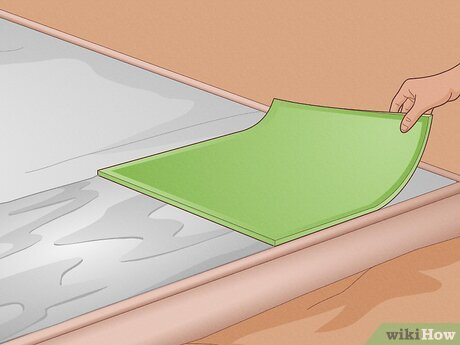

1 Apply texture skins around the perimeter of the slab.
Lay down a texture skin so it lines up with the outside edge of the slab. Pat the skin down with your hands, then carefully lift it straight upward. Repeat by carefully laying the skin right next to the area where it was just applied.[4]

To create an even pattern, concrete stamps usually line up so they’re offset or staggered. This might leave a gap between some of the stamps and the edge of the concrete. Using the texture skins will ensure you get a consistent look on your finished slab.
Choose texture skins that match the texture of your concrete stamps.

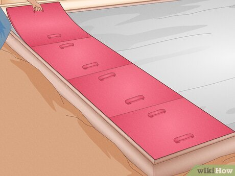

2 Line up the stamps all the way across one end of the slab.

You’ll need enough stamps to reach in a row from one end of the slab to the other, plus two extra to begin the next row. That way, you can complete a whole row at once. The extra stamps on the second row will give you something to stand on when you start moving the stamps off of the first row.[5]

Be sure to follow the manufacturer’s instructions for how the stamps should be lined up—they usually need to go in a specific order or pattern. For instance, you may have specific stamps to go in the corners or along the outside edges of the slab.[6]

If there’s a gap between the edge of the slab and some of the first row of stamps, either apply a stamp just along the outside edges so the unused part hangs off of the slab, or come back after you stamp the concrete and use detailing tools to finish that area.[7]

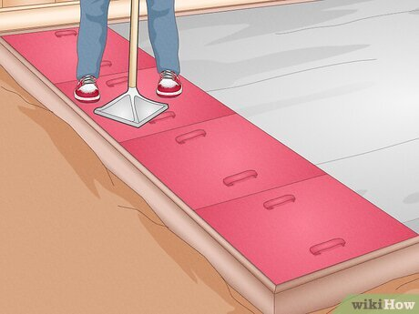

3 Tamp down the first row of stamps, one at a time.

Stand on the first stamp and firmly pat it down with a steel tamper. Cover the entire surface of the stamp. Once you’re finished, step onto the second stamp and tamp it down. Continue tamping down the first row and the first two stamps on the second row.[8]

Don’t press down too hard—just enough to imprint the stamp into the concrete.

Always stand on the stamp while you’re tamping it. If you stand beside the mat and tamp it, the stamp might move a little, which can give you an uneven finish.[9]

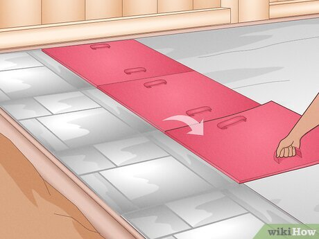

4 Move the first row of stamps to the second row.

Standing on the second row of stamps, carefully lift a stamp from the first row, then lay it down on the second row. Tamp it down with your stamping tool, then take the next stamp and lay it down as well.[10]

Be sure to line up the stamps in the order they’re supposed to go based on the manufacturer’s instructions.

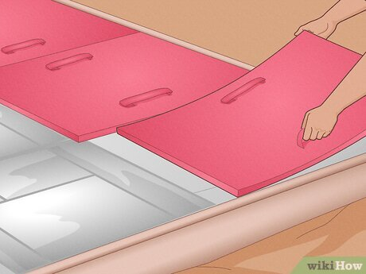

5 Continue moving the stamps as you go all the way across the slab.

Move the stamps one at a time to create new rows. Keep lifting and placing the stamps in the correct order until you've stamped the entire surface of the concrete.[11]

Be careful to only stand on the stamps—the concrete is still wet, so if you step directly on it, you’ll leave permanent footprints.

## Detailing and Sealing the Concrete After Stamping

1 Use touch-up tools to add detail to any lines that need more indentation.

Sometimes the pressure of the stamps can cause concrete to come up between the mats, which can affect the neatness of the design. Use a concrete touch-up wheel (it looks like a pizza cutter) to go back over those lines.[12]

You can also use heavy-duty chisels for detailing—this can be helpful to create a design in areas where the mat doesn’t quite fit, like against a wall.[13]

You can have a helper do this while you work on the stamps, or you can come back and do it after you’re finished. Just be sure to do it while the concrete is still wet.

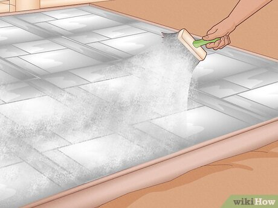

2 Protect the concrete by broadcasting more release powder.

Your concrete needs to dry for a few days, and during that time, it can be damaged if it gets wet. If there’s a chance of rain or you live in an area with high humidity, broadcast another layer of release powder over the entire surface of the concrete you just stamped.[14]

Release powder will repel water, which will help keep the concrete dry.

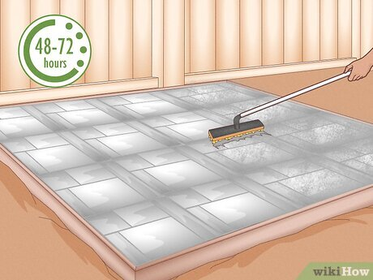

3 Clean the concrete after 48-72 hours.

Allow the concrete to set for two or three days. Once it’s hardened, sweep the excess release powder off of the entire slab. Then, wash the concrete with a pressure washer.[15]

Set your pressure washer so the water sprays out in a fan rather than a single jet stream—if the water pressure is too high, it could damage the design on the concrete.

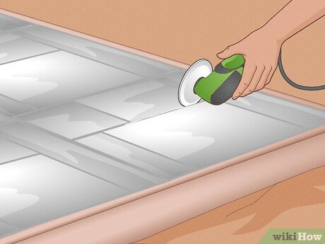

4 Use chisels or a grinder to finish any detail work.

Once the concrete is cleaned, you may see lines that aren’t as sharp as you’d like. Use a grinder fitted with a diamond tuck-point or crack-chasing blade or a concrete chisel to fix any last details.[16]

It's okay if you see the bare concrete beneath the color. You'll fix that in the next step.

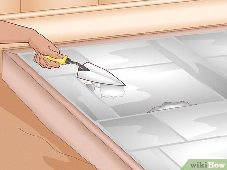

5 Repair any cracks or chips.

Tap any small cracks with a hammer to close them—within the first few days, the concrete will still be soft enough to mold back together. If there are any big chips in the concrete left by your detail work, mix your powdered color with a little water and apply the paste as a patch.[17]

If your detail work left any bare concrete in the joints, apply color powder release with a brush to cover it.

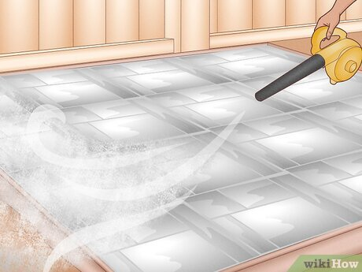

6 Blow any excess dust off of the slab.

If you applied any additional powder release or color hardener, use a blower to clean off the surface of the concrete. If you leave the powder on the slab, it will create a gritty texture under the sealer.[18]

7 Seal the concrete to protect it from water.

Apply thin coats of the sealant. According to Hoang, sealer will “help water bead on the surface of the concrete instead of absorbing into it, which will help the concrete last longer. It will also bring out its rich color.”

As a bonus, Hoang says that using a sealer can help make concrete non-slip and prevent stains and fading.

Reapply the sealant after the concrete fully cures and again about once a year, or as needed.

8 Allow the concrete to cure for 30 days.

It can take 30 days or more for concrete to completely harden. During that time, don’t put furniture on the concrete, and avoid walking on it as much as possible.

If you’re planning to paint your concrete, painting specialist Andre Kazimierski

> recommends allowing concrete to cure for at least 30 first. To be sure the color will last, he recommends starting with a high-quality masonry primer. Top that with a concrete stain or exterior paint.
