# How to Tie Rebar

Co-authored by Gerber Ortiz-Vega

Last Updated: September 18, 2024

Building with concrete involves many steps to achieve the best results, including forming, grading, placing, and finishing. One critical step is placing the reinforcing bars, or rebar, correctly, and this article will explain how this is done.

## Part 1

1 Plan the project. For structural concrete construction, an engineer and architect will usually do the technical design work and provide specific information regarding the sizes, configuration, and placement of rebar in the associated concrete work. Planning the actual fabrication and placement, as well as the schedule of the work is your first task.

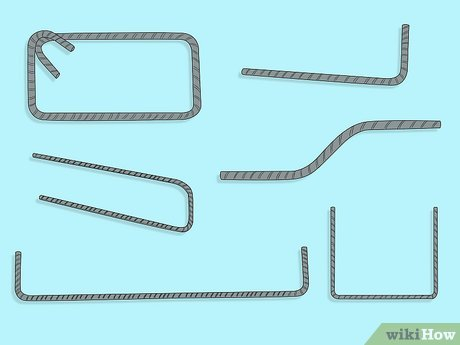

2 Purchase the rebar. For simple projects like typical building foundations and slab reinforcement, you can most likely buy the necessary rebar from a building supply center or home improvement warehouse. For complicated applications such as grade beams, foundation walls, tanks, and other projects, you will need to have specific shapes formed by a rebar fabrication specialist. Here are some examples:

- Stirrups - These are shaped rebar that hold the lateral reinforcement in a certain configuration, often called a cage. They create a framework that keeps these larger bars in position, and may be round, square, rectangular, or even complex combinations of shapes.
- Dowels - These are usually L shapes, or straight lengths of rebar with a ninety degree bend on one end.
- Corner bars - These are also L shapes, with each side of the ell the same length.
- Offset bends - These range from a simple Z shape to complex angles, used in reinforcing concrete walkway steps and steps (changes in elevation) in concrete footings.
- Hairpins - These are U shaped rebar that are often used to interlock two or more individual mats of rebar to give lateral strength to the concrete casting.
- Candy canes - As the name implies, these are straight lengths of rebar with a U shaped bend on one or both ends, again to interlock two or more parallel reinforcing mats.

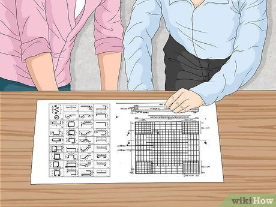

3 Consult your reinforcing placement drawings/plan. If you purchase your rebar from a fabricator, the supplier will usually review your structural engineer's or architect's plans and produce a shop drawing with details and identifying tags for each type of rebar used in the project. For simpler projects, your building plans should provide spacing requirements and bar sizes. Use these documents to determine where and what rebar is needed in individual locations.

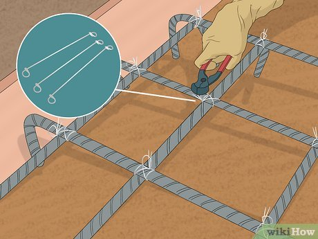

4 Choose the method you will use to tie the rebar. Most times, rebar is tied with annealed steel wire, either bought in four pound bulk rolls, or if using a bag tie spinner, in bundles of precut wire pieces with loops formed on both ends. The latter are easier for novices to use, but somewhat more expensive, the former is often the choice of experience rebar tiers (rodbusters).[2]

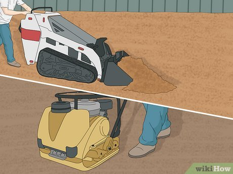

5 Prepare the area where the concrete is to be placed. The ground should be graded and compacted after any needed subgrading, excavations, and underground rough ins for plumbing and electrical utilities is finished. Lay out the actual perimeter or form lines for the concrete placement after the grading and compaction and associated testing is done.

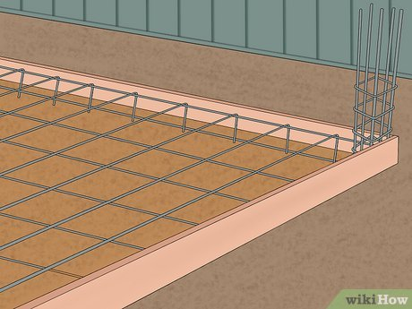

6 Decide whether the concrete forms will be installed prior to placing your rebar. For large footings where heavy rebar is to be used, the formwork usually is done first, for concrete walls and grade beams, one side of the form may be built prior to tying the rebar, but the rebar will need to be tied in place before the formwork is completed so bars can be positioned and tied in place. For concrete slabs, the subgrade (ground underneath the slab) is often pre-treated for termites, and a moisture barrier or dampproofing is installed before the mat is tied.

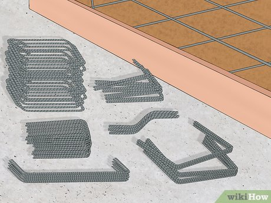

7 Shake out the rebar.[3] This involves removing individual bars, stirrups, and dowels from their respective bundles according to the placement drawing counts. An example would be a slab measuring 12 feet (3.7 m) by 12 feet (3.7 m) with rebars at 8 inch (20.3 cm) centers in one direction, and 12 inch (30.5 cm) centers the other. Determine the size of bars required in each direction, mark two or three bars with the appropriate layout measurements in each direction, and count the marks to determine how many rebar are required for each direction. Often, the placement drawings are specific, such as "18 (number 5) rebar, 11 foot (3.4 m) 6 inches (15.2 cm) long, one half each way". This gives the following information: You need the given quantity, 18, rebar, size 5 (5/8 inch diameter), with 9 bars laying in each direction, the top rows perpendicular to the bottom ones.

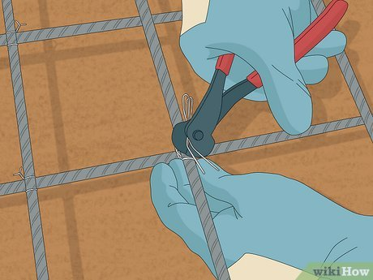

8 Tie your rebar. This is the primary focus of this article. Tying the bars so that they remain in their correct respective positions is critical to achieve the desired strength of the completed concrete structure.

9 Place each rebar in its respective position according to the layout described in the previous steps. The layout bars (or mark bars) can be marked with a soapstone marker, a paint pen, a piece of lumber crayon, or with spray paint.

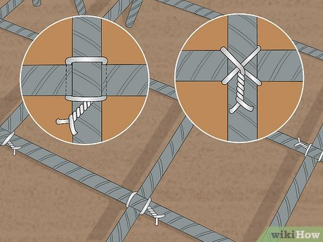

10 Select the appropriate type of tie you will use. For the bag ties (Snap Ties, not to be confused with the snap ties described later). For ordinary slab mats, where the force of the concrete interacting with the rebar during its placement is minimal, and movement of the mats is unlikely, using a simple, single twist of wire around each rebar intersection, twisted together tightly, will suffice. This tie is known as a snap tie, and can be made with the snap tie precut ties and a spinner, noted earlier. It can also be done easily with a pair of 9 inch (22.9 cm) lineman's pliers and bulk wire held on the rodbuster's workbelt in a wire reel. For other applications where the force of the concrete placement may displace the rebars, or where more strength is needed to hold bars in the proper configuration, more complicated ties may be used. Here are some of them, with a simplified description of how they are made:[4]

- Figure 8 ties - These are made by pulling the wire around the rear (from the rodbuster) bar, diagonally across the front bar, back around the rear bar, diagonally in the opposite direction across the front bar, and then twisting back around the beginning wire. You then cut the wire feeding off the reel, and bend the cut ends back towards the tie so no sharp ends project from the tie. These ties will help hold perpendicular bars tightly together while helping to prevent them from racking, or moving diagonally.
- Saddle ties - Similar to the figure 8 tie, you begin by passing the wire feeding from your reel behind the rear bar, then across the front bar staying parallel to the bar. You then pass it behind the rear bar again, back around the front bar on the opposite side. You now twist the ends together, cut the feed wire, and bend the cut ends back. This tie is often used when tying rebar for walls or other vertical application where the rodbuster will actually climb on the rebar framework to access higher portions of the wall. The figure 8 and saddle tie can often be interchanged, however, technically speaking, there are advantages to each one in certain circumstances.
- Combinations of figure 8 and saddle ties with additional wraps around vertical rebars can be used to increase the hold of the tie so bars cannot slip downward when weight is applied to them or the plastic concrete is dropped into the form.

11 Use your pliers for tying these ties efficiently. For all the above mentioned ties, you pull the feeding end from the wire reel with your non-dominant (hereafter regarded as left, please reverse for right handed persons) hand. Grip the end of the wire with your pliers in your right hand, and poke, or push it behind the rebar described in the first step of your chosen tie. Bend or angle the end toward the place you will be grabbing the end in the next step of the tie, then reach from that side, grip it again with the pliers, pull it toward the next place you will route it to, pulling enough slack wire to complete the tie. Hold resistance on the wire with your left hand, so the wire bends snugly against the bar you are wrapping in each stage of the tie. Release the wire so that the pliers can be used to grip it, and do so, pulling the end around the bar and twist the two ends of the wire together. Pull or tug the wire with the pliers so the tie is tight.[5]

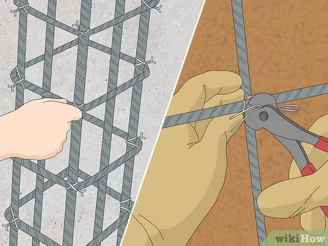

12 Tie all the bars required in their correct positions. Check your plans to make sure each component of the reinforcement is in place. Often, in structural concrete reinforcement, you will find several elements that interface together in addition to the basic rebar mat discussed so far. Here are a few to note:

- Block dowels - When placing a concrete foundation which will have concrete masonry units (block) erected on it, you will usually find the plans require installing block dowels, or vertical rebar to reinforce cells at a required spacing to give the subsequent block wall sufficient strength to withstand conditions to which it will be exposed, or to help it support loads it will carry as an overall part of the structure you are building. These bars are tied to the foundation rebar (footing bars) in a location that will place them in the center of individual block cells. For them to be placed correctly, you will need to establish the wall line, then determine the spacing of these cells. If your layout begins at a corner, using 8X16 inch regular block, you can place the first dowel 4 inches (10.2 cm) inside the outside wall line, 4 inches (10.2 cm) from the corner, then space additional bars at their required distances in multiples of 8 inches (20.3 cm). For example, at 16, 24, or 32 inch centers. This is known as blockwork spacing.
- Bulkhead dowels - In instances where a footing will not be completed in a single concrete placement, you will need to dowel out of the bulkhead form so the next placement will be structurally tied to the latter one. Make sure the dowels extend far enough that the lateral reinforcement will overlap enough to maintain the strength of the rods used. Typically, rebar lap is calculated in bar diameters. An example would be the number 5 rebar mentioned earlier. It has a diameter of 5/8 of an inch, and the required lap might be 40 bar diameters. Multiplying the diameter 5/8 by 40, you will get 200/8 or 25 inches (63.5 or 63.5 cm).
- Note that in structural concrete, other types of imbeds and inserts may be required. Place rebar in such a manner as to allow installation of anchor bolts, sleeves, embedded weld plates, inserts, or other items in their respective correct locations without interference. In general terms, these items require more precise positioning, so offsetting one or two rebars may be required.

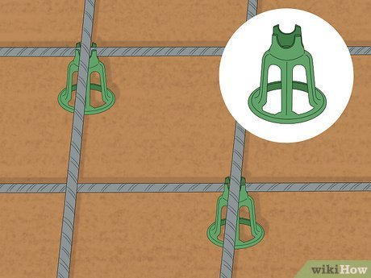

13 Chair or support your rebar. Once the mat or cage is assembled, you must hold it in position so the concrete will cover it completely. Rebar chairs or concrete brick are often used for this purpose. Place these positioners at a spacing that will not allow the rebar to bend or deflect enough to reduce the coverage you wish to obtain with the concrete you place in you forms. For a 12 inch (30.5 cm) thick footing, the rebar mat is usually placed about 4 inches (10.2 cm) from the bottom of the concrete, and side clearances range from 2 to 4 inches (5.1 to 10.2 cm).

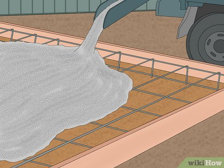

14 Observe the rebar configuration while the concrete is placed. If shifting occurs, support the rebars with a handled tool like a shovel wedged so that you can achieve sufficient leverage to hold its position, or alter the direction of flowing concrete so force is applied in the opposite direction.

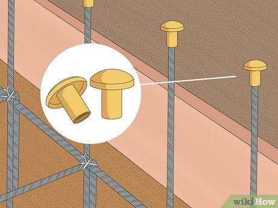

15 Cap or otherwise protect any exposed bars while working near them. Rebar that is sheared, or mechanically cut has very sharp surfaces at the location of these cuts. Construction workers have suffered serious injuries and have also been killed when they have fallen on projecting rebar dowels. Special rod caps made of high impact plastic with a metal plate embedded in them are required by the Occupational Safety and Health Administration (OSHA), in the United States.[6]

