# How to Wrap Beams
Co-authored by Ryaan Tuttle

Last Updated: September 18, 2023

Wrapping ceiling beams is an easy way to add a touch of vintage charm to any room. It’s a pretty simple project, requiring just a few supplies. Start out by choosing the material you want to cover the beam with--you can use lumber, flooring, or even prefabricated faux beams. Once the material is prepared and cut to size, have some help you hold the pieces up while you fix them in places with glue, nails, or screws. Once the beam is covered, you’re done!

## Part 1 Selecting Your Material
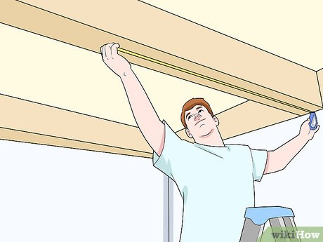

1 Measure your beams. Get a tape measure and check the length of each beam you want to cover, from one end to the other. Have someone hold the tape measure at one end of the beam while you run it to the other end to check the length. You’ll probably need to stand on a ladder or other safe surface to reach the ceiling.[1]

Use only a ladder that has 4 feet (1.2 m) that sit flat on the floor. For extra security, have someone hold the ladder while you climb up.

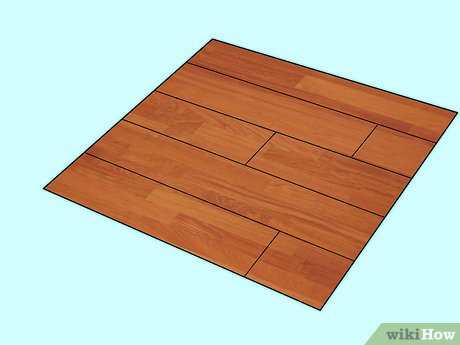

2 Choose hardwood flooring for a quick wrap. Hardwood flooring is pre-colored, so that you can wrap your beams in a snap. You can find it at most hardware or lumber supply stores. It’s usually sold in large pallets, but let the store know you’re looking for a small lot. They may have some leftovers that will be perfect for your job.[2]

If the leftover or scrap flooring is a little beat-up, that can actually make your wrap look even more authentic.

You can find flooring for about \$3 per square foot. So, if you want to wrap a beam that is 3 inches (7.6 cm) wide on the sides, and 4 inches (10 cm) by 10 feet (3.0 m) long, it will cost about \$33.

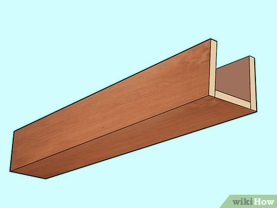

3 Select faux wood beams for the most authentic look. Several companies now manufacture three-sided beams made out of synthetic material. These look like vintage wood, and are designed to easily wrap over existing beams. Check with your local hardware store, and buy at least enough length to cover your beams.

A faux beam that is 13 feet (4.0 m) long will cost about \$200.

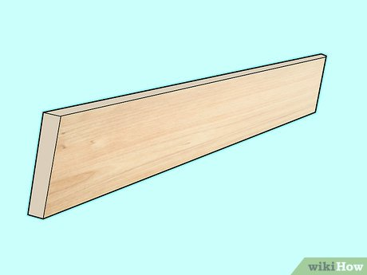

4 Buy lumber if you want to stain the wrap to a particular color. You can use basically any wood you want. Whitewood pine is an inexpensive choice that can be made to look like vintage lumber by distressing it. Buy enough wood to equal 3 times the length of the beam(s) you want to cover.[3]

Whitewood can cost around $6 dollars for plank that is 1 inch (25 mm) by 4 inches (10 cm) by 8 feet (2.4 m).

So, if you want to wrap a beam that is 3 inches (7.6 cm) wide on the sides, and 4 inches (10 cm) by 8 feet (2.4 m) long, it will cost about $36.

You can stain the wrap any color you like.

## Part 2 Preparing Your Material
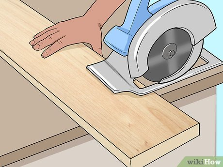

1 Cut your lumber to size, if necessary. If your faux beams or lumber are longer than the beam you want to cover, cut the pieces down to the right size with a ripsaw, circular saw, or table saw. Likewise, if one piece of your material isn’t enough to cover the beam, cut another piece.[4]

For instance, if your beam is 6.5 feet (2.0 m) long, and your lumber is 5 feet (1.5 m) long, cut another piece that is 1.5 feet (0.46 m) long to have enough to cover the whole thing.

Sand the cut edges before continuing.

If you don't like the look of the seams this creates, you can cover them with metal brackets or straps after you finish wrapping.

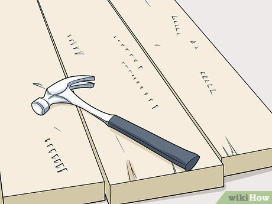

2 Distress the lumber if you want a vintage look. If you are using new wood (not flooring or faux beams), take a hammer, chain, pole, or other material and randomly beat all over the wood. This will make it look like the lumber has natural wear and tear from age.[5]

It might sound like this won't work, but if you just hit all over the board, it will create a pattern of wear that looks authentic.

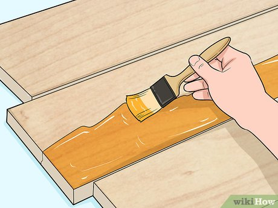

3 Stain or paint the lumber. If you’re using new wood, brush two coats of stain or paint on all sides, in whatever color you want. Let it dry for 24 hours before assembling the pieces over your beam.[6]

## Part 3 Covering the Beams

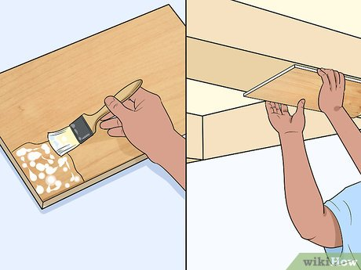

1 Glue down the flooring pieces, if you’re using them. Flooring can be applied directly to the beam, just by laying enough pieces to cover it. Spread wood glue on the back of each piece, then tack it in place with finishing nails. Cut pieces as necessary to cover the whole beam.[7]

For example, if the face of your beam is 6 feet (1.8 m) long by 6 inches (15 cm) wide, and your flooring is 1 foot (0.30 m) by 6 inches (15 cm) long, you’ll need to glue and nail down 6 pieces to cover the face.

If the sides of the beam are 3 inches (7.6 cm) wide, you’ll need to cut 6 pieces of flooring in half so they are 3 inches (7.6 cm) by 12 inches (30 cm) long. Glue and nail them down to cover one side, and then repeat for the other.

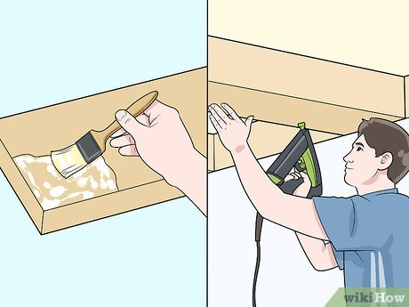

2 Nail your lumber in place. If you’re using new lumber, put wood glue on the back of each piece. Set them in place over the beam and use a nail gun or hammer and nails to hold it down. Ask someone to help you hold the lumber in place so it’s easier to nail down. Don’t forget to cover the sides as well.[8]

Put nails every 6 inches (15 cm) along each side of each board.

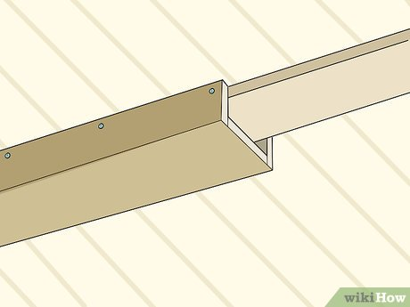

3 Set the faux beams in place with screws, alternatively. Have someone hold up one end of the faux beam, while you hold the other. The open side of the three-sided faux beam should slip right over the existing beam. Place screws every 6 inches (15 cm) along the edges of the beam where it meets the ceiling.

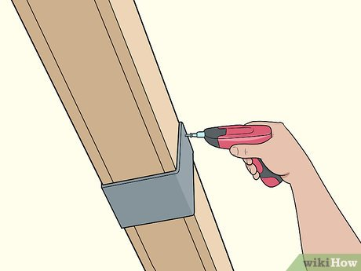

4 Add metal straps, if desired. If you want to add character, wrap metal straps or brackets over the beams every few feet. Metal straps/brackets can also be a way of hiding the seams where lengths of lumber meet. You can find decorative brackets made to fit over beams at a hardware store.

Brackets will have pre-drilled holes. Drive screws through the hardware pieces and into the beam to hold them in place.

Metal straps may also have pre-drilled holes. If not, the metal should be thin enough that you can drive screws straight through and into the beam.
